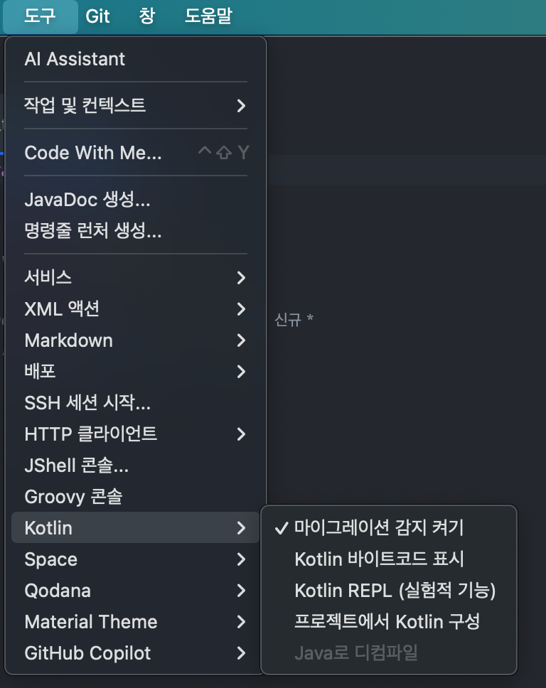

# 4장 코루틴의 실제 구현

- 중단 함수는 함수의 시작할 때, 함수가 호출되었을 때 `상태`를 가진다는 점에서 상태 머신(state machine)과 비슷하다.
- Continuation 객체는 상태를 나타내는 숫자와 로컬 데이터를 가지고 있다.
- 함수의 Continuation 객체가 이 함수를 부르는 다른 함수의 Continuation 객체를 장식(Decorate) 한다. 그 결과, 모든 Continuation 객체는 실행을 재개하거나 재개된 함수를 완료할 때 사용되는 Call Stack 으로 사용된다.

### 📌 Continuation 전달 방식

- 중단 함수가 구현될 수 있는 수많은 방법 중에 코틀린 팀은  `Continuation Passing Style` 을 사용한다. 이전의 설명했던 것처럼 Continuation은 함수에서 함수로 인자를 통해 전달 된다. 관례상 Continuation은 마지막 파라미터로 전달된다.

> 💡CPS (Continuation Passing Style) 개념은 함수 호출이 완료된 후 다음에 수행할 작업인 CallBack 함수를 전달하는 방식이다.

```kotlin
suspend fun getUser(): User?
-> 
fun getUser(continuation: Continuation<*>): Any?

suspend fun setUser(user: User)
-> 
fun setUser(user: User, continuation: Continuation<*>): Any
```

- 중단 함수 내부를 보면 원래 선언된 형태와 반환 타입이 달라진 것을 알 수 있다.

> ❔Any 또는 Any?로 바뀌 었는데 이는 중단 함수를 실행하는 도중에 중단되면 선언된 타입의 값을 반환하지 않을 수 있기 때문이다.

- 이때 중단 함수는 특별한 마커인 `COROUTINE_SUSPENDED` 를 반환한다. → 위의 예시에서 해당 마커를 반환 할 수 있기 떄문에 결과 타입이 슈퍼타입인 Any, Any?로 지정 된것이다.

### 📌 **간단한 중단 함수 구현**

```kotlin
suspend fun myFunction() {
    println("Before")
    delay(1000)  // 중단 함수
    println("After")
}
```

- 간단하게 이 함수는 실행 시 `println("Before")`를 출력한 후, 1초 동안 중단된다. 이후 `println("After")`를 출력하도록 한다.
    - 이 과정에서 `Continuation` 객체가 생성되어 상태를 관리한다.

여기서 상태 저장이 필요한 Continuation 객체를 편하게 부르기 위해 임의로 `MyFunctionContinuation` 이라고 하자.

이때 클래스에 포장이 없는 경우에만 클래스를 포장해야 한다. 따라서 만약 코루틴이 재실행되고 있으면 Continuation 객체는 이미 래핑되어 있을 것으로 사용중인 객체를 그대로 둬야한다.

```kotlin
val continuation = continuation as? MyFuctionContinuation
		?: MyFunctionContinuation(continuation)
```

### 📌 **Continuation 객체를 활용한 상세 구현**

- 위 함수가 시작되는 지점은 함수의 시작점, 중단 이후 재개 시점 `두 곳`이다.
- 현재 상태를 저장하기 위해서는 `label` 이라는 필드를 사용하여 저장하며, 함수가 처음 시작될 때 이 값은 0으로 설정된다.

```kotlin
fun myFunction(continuation: Continuation<Unit>): Any {
    val continuation = continuation as? MyFunctionContinuation ?: MyFunctionContinuation(continuation)
    if (continuation.label == 0) {
        println("Before")
        continuation.label = 1
        if (delay(1000, continuation) == COROUTINE_SUSPENDED) {
            return COROUTINE_SUSPENDED
        }
    }
    if (continuation.label == 1) {
        println("After")
        return Unit
    }
    error("Impossible")
}
```

- delay를 통해 중단된 경우 `COROUTINE_SUSPENDED` 를 반환

> ❔`COROUTINE_SUSPENDED` 는 빌더 함수나 “재개(Resume)” 함수에 도달할 때까지 전달이 된다.

### 📌 익명 클래스로 구현된 Continuation 객체

- 지금까지 설계한 함수를 간략화한 가톡성을 위해 MyFunctionContinuation이라는 클래스로 나타낸 클래스는 다음과 같다.

```kotlin
class MyFuctionContinuation(
		val completion: Continuation<Unit>
) : Continuation<Unit> {
		override val context: CoroutineContext
				get() = completion.context
		
		
		var label = 0
		var result: Result<Any>? = null
		
		override fun resumeWith(result: Result<Unit>) {
				this.result = result
				val res = try {
						val r = myFunction(this)
						if (r == COROUTINE_SUSPENDED) return
						Result.success(r as Unit)
				} catch (e: Throwable) {
						Result.failure(e)
				}
				completion.resumeWith(res)
		}
}
```

> ❔자바로 디컴파일된 코드를 보기 위해서 Intellij의 Tools > Kotlin > Show Kotlin Bytecode 를 선택할 수 있다.



### **📌 상태를 가진 함수**

```kotlin
suspend fun myFunction() {
    println("Before")
    var counter = 0
    delay(1000)  // 중단 함수
    counter++
    println("Counter: $counter")
    println("After")
}
```

- 위와 같이 함수가 중단된 후에 다시 사용할 counter의 경우 0, 1로 표시된 두 상태에서 사용되므로 Continuation 객체를 통해 이를 저장해야 한다.
- 간략화된 중단 함수의 모습은 다음과 같다. (위 코드를 디컴파일 해보면 Java 코드를 볼 수 있다.)

```kotlin
fun myFunction(continuation: Continuation<Unit>): Any {
    val continuationImpl = continuation as? MyFunctionContinuation ?: MyFunctionContinuation(continuation)

	  var counter = continuation.counter
    if (continuation.label == 0) {
        println("Before")
        counter = 0
        continuation.counter = counter
        continuation.label = 1
        if (delay(1000, continuation) == COROUTINE_SUSPENDED) {
            return COROUTINE_SUSPENDED
        }
    }
    if (continuation.label == 1) {
		    counter = (counter as Int) + 1
		    println("Counter: $counter")
        println("After")
        return Unit
    }
    error("Impossible")
}

class MyFuctionContinuation(
		val completion: Continuation<Unit>
) : Continuation<Unit> {
		override val context: CoroutineContext
				get() = completion.context
		
		
		var label = 0
		var counter = 0
		var result: Result<Unit>? = null
		
		override fun resumeWith(result: Result<Unit>) {
				this.result = result
				val res = try {
						val r = myFunction(this)
						if (r == COROUTINE_SUSPENDED) return
						Result.success(r as Unit)
				} catch (e: Throwable) {
						Result.failure(e)
				}
				completion.resumeWith(res)
		}
}
```

### 📌 값을 받아 재개되는 함수

- 중단 함수로 값을 받아야하는 경우는 좀 더 복잡하다.

```kotlin
suspend fun printUser(token: String) {
    println("Before")
    val userId = getUserId(token) // 중단 함수로 생각
    println("Got userId: $userId")
    val userName = getUserName(userId, token) // 중단 함수로 생각
    println(User(userId, userName))
    println("After")
}
```

- 위 함수에서 getUserId, getUserName 이라는 두 개의 중단 함수가 있다고 하자. 이 함수들은 token 이라는 파라미터를 받으면 중단 함수는 특정 값을 반환 한다.
    - 파라미터와 반환값 모두 Continuation 객체에 저장되어야 하는 이유는 다음과 같다.
        - token은 상태 0, 1에서 사용된다.
        - userId는 상태 1, 2에서 사용된다.
        - Result 타입인 result는 함수가 어떻게 재개되었는지 나타낸다.

```kotlin
class PrintUserContinuation(
    val completion: Continuation<Unit>,
    val token: String
): Continuation<Unit> {
    
    var label = 0
    var userId: String? = null
    val result: Result<Unit>? = null

    override val context: CoroutineContext
        get() = completion.context

    override fun resumeWith(result: Result<Unit>) {
        this.result = result
        val res = try {
            val r = printUser(token, this)
            if (r == COROUTINE_SUSPENED) return
            Result.success(r as Unit)
        } catch (e: Throwable) {
            Result.failure(e)
        }
        completion.resumeWith(res)
    }
}

fun printUser(
    token: String,
    continuation: Continuation<*>
): Any {
    val continuation = continuation as? PrintUserContinuation
        ?: PrintUserContinuation(
            continuation as Continuation<Unit>,
            token
        )

    val result: Result<Any>? = continuation.result
    var userId: String? = continuation.userId
    val userName: String

    if (continuation.label == 0) {
        println("Before")
        continuation.label = 1
        val res = getUserId(token, continuation)
        if (res == COROUTINE_SUSPENDED) {
            return COROUTINE_SUSPENDED
        }
        result = Result.success(res)
    }
    if (continuation.label == 1) {
        userId = result!!.getOrThrow() as String
        println("Got userId: $userId")
        continuation.label = 2
        continuation.userId = userId
        val res = getUserName(userId, token, continuation)
        if (res == COROUTINE_SUSPENDED) {
            return COROUTINE_SUSPENDED
        }
        result = Result.success(res)
    }
    if (continuation.label == 2) {
        userName = result!!.getOrThrow() as String
        println(User(userId as String, userName))
        println("After")
        return Unit
    }
    error("Impossible")
}
```

### 📌 Call Stack

- 함수 A가 함수 B를 호출한다면 가상 머신은 A의 상태와 B가 끝나면 실행이 될 지점을 어딘가에 저장을 해주어야 한다. 이러한 정보들은 모두 Call Stack이라는 자료 구조에 저장 된다.
- 코루틴을 중단하면 스레드를 반환해 Call Stack에 있는 정보가 사라질 것이다. 따라서 코루틴을 재개할 때는 Call Stack을 사용할 수 없지만, 대신 Continuation 객체가 Call Stack의 역할을 대신한다.

```kotlin
 if (continuation.label == 1) {
        userId = result!!.getOrThrow() as String
        println("Got userId: $userId")
        continuation.label = 2                                 // 다음 Label 저장
        continuation.userId = userId                           // Continuation 객체에 상태를 저장
        val res = getUserName(userId, token, continuation)     // 중단 함수 호출
        if (res == COROUTINE_SUSPENDED) {                         // 중단 상태
            return COROUTINE_SUSPENDED                            // 중단 상태
        }                                                         // 중단 상태
        result = Result.success(res)                           // 중단 되지 않았다면 결과값을 설정
    }
    if (continuation.label == 2) {
        userName = result!!.getOrThrow() as String             // 실패할 경우 예외를 던짐
        println(User(userId as String, userName))              // 결과값을 읽음
        println("After")
        return Unit
    }
```