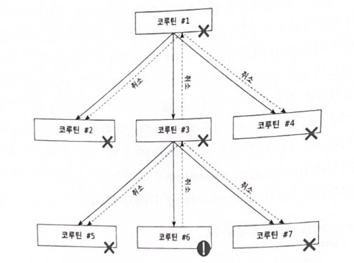
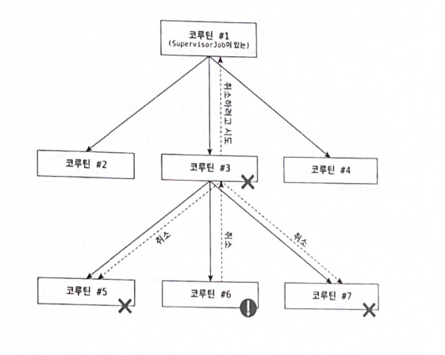
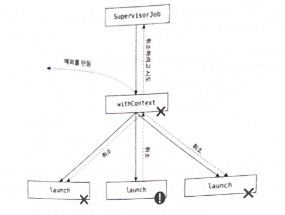

# 10장 예외 처리

- 코루틴에서 예외의 차이점은 코루틴 빌더는 부모도 종료시키며, 취소된 부모는 자식들 모두를 취소시킨다는 점이다.
- 이는 하나의 코루틴이 취소된다면 연결 되어 있는 부모-자식간은 쌍방으로 모두 전파되어 취소가 된다.

### 📌 코루틴 종료 멈추기



- 코루틴 간의 상호작용은 Job을 통해서 일어나기 때문에, 코루틴 빌더 내부에서 새로운 코루틴 빌더를 try-catch 문을 통해 래핑하는 건 도움되지 않는다.

```kotlin
fun main(): Unit = runBlocking {
    // try-catch 로 래핑하지 말자 (무시 된다)
    try {
        launch {
            delay(1000)
            throw Error("Some error")
        }
    } catch (e: Throwable) {
        println("Will not be printed")
    }
    launch {
        delay(2000)
        println("Will not be printed")
    }
}
// Exception in thread "main" java.lang.Error: Some error
```

### 📌 SupervisorJob

- 코루틴 종료를 멈추는 가장 중요한 방법은 `SupervisorJob` 을 사용하는 방법이다.
- SupervisorJob을 사용하면 자식에서 발생한 모든 예외를 무시할 수 있다. (전파가 부모로 되지않음)



```kotlin
fun main(): Unit = runBlocking {
    val scope = CoroutineScope(SupervisorJob())
    scope.launch {
        delay(1000)
        throw Error("Some error")
    }
    scope.launch {
        delay(2000)
        println("Will be printed")
    }
    delay(3000)
}
// Exception in thread "DefaultDispatcher-worker-2" java.lang.Error: Some error
// Will be printed
```

- 흔한 실수 중 하나가 SupervisorJob을 아래 코드와 같이 부모 코루틴의 인자로 사용하는 것이다.
- 이럴 경우 SupervisorJob은 단 하나의 자식만 가지기 때문에 예외를 처리하는 데 아무런 도움이 되지 않는다.

```kotlin
fun main(): Unit = runBlocking {
    launch(SupervisorJob()) {
        launch {
            delay(1000)
            throw Error("Some error")
        }
        launch {
            delay(2000)
            println("Will be printed")
        }
    }
    delay(3000)
}
```

- 하나의 코루틴이 취소되어도 다른 코루틴이 취소되지 않는다는 점에서, 같은 Job을 다수의 코루틴에서 Context로 사용하는 것이 좀더 나은 방법이다.

```kotlin
fun main(): Unit = runBlocking {
    val job = SupervisorJob()
    launch(job) {
        delay(1000)
        throw Error("Some error")
    }
    launch(job) {
        delay(2000)
        println("Will be printed")
    }
    job.join()
}
// Exception in thread "main" java.lang.Error: Some error
// (1초 후)
// Will be printed
```

### 📌 supervisorScope

- 예외 전파를 막는 또 다른 방법은 코루틴 빌더를 `supervisorScope` 로 래핑하는 것이다. 이는 다른 코루틴에서 발생한 예외를 무시하고 부모와의 연결을 유지한다는 점에서 아주 편리하다.

```kotlin
fun main(): Unit = runBlocking {
    supervisorScope {
        launch {
            delay(1000)
            throw Error("Some error")
        }

        launch {
            delay(2000)
            println("Will be printed")
        }
    }
    delay(1000)
    println("Done")
}
// Exception in thread "main" java.lang.Error: Some error
// Will be printed
// Done
```

- supervisorScope는 단지 중단 함수일 뿐이며, 중단 함수 본체를 래핑하는 데 사용된다.
- supervisorScope는 `withContext(SupervisorJob)`으로 대체될 수 없다. 이는 `Job`이 상속 되지 않는 유일한 Context이기 때문이다.
    - 코루틴은 각각 자신만의 잡을 가지고 있고, Job을 다른 코루틴에 전달하여 부모 관계를 맺는다. 따라서 withContext(SupervisorJob) → SupervisorJob이 withContext의 부모가 된다. 따라서 자식 코루틴에서 예외가 발생하면 withContext 코루틴으로 전달이 되며, Job이 취소되고, 자식 코루틴 또한 전부 취소되며, 마지막으로 예외가 던져진다.



### 📌 await

- async의 경우 블록 안에서 예외가 발생하면 이를 즉시 처리하는게 아니라 나중에 await()가 불리는 시점에 이를 처리한다. 따라서 try-catch를 await() 시점에 사용하면 된다.

```kotlin
fun main(): Unit = runBlocking {
    val scope = CoroutineScope(SupervisorJob())

    val deferred = scope.async {
        delay(1000)
        throw Error("Some error")
    }

    try {
        deferred.await()
    } catch (e: Throwable) {
        println(e)
    }
    delay(2000)
    println("Done")
}
// java.lang.Error: Some error
// Done
```

### 📌 CacellableException은 부모까지 전파되지 않는다

- 예외가 CancellationException의 서브클래스면 부모로 전파되지 않는다.

```kotlin
object MyNonPropagatingException: CancellationException()

suspend fun main(): Unit = coroutineScope {
    launch { // 1
        launch { // 2
            delay(2000)
            println("Will not be printed")
        }
        throw MyNonPropagatingException // 3
    }
    launch { // 4
        delay(2000)
        println("Will be printed")
    }
}
```

- 코드를 보면 두 개의 코루틴이 1과 4의 빌더로 시작된다. 3에서 MyNonPropagatingException 예외를 던지게 되면 이는 1에서 시작된 launch에서 잡게 된다.
- 1에서 시작된 코루틴은 자기 자신을 취소하고 2에서 정의된 launch 자식 코루틴 또한 취소 시킨다. 4에서 시작된 두 번째 launch는 영향을 받지 않고 출력하게 된다.

### 📌 코루틴 예외 핸들러

- 예외를 다룰 때 예외를 처리하는 기본 행동을 정의하는 것이 유용할 때가 있다. 이때 CoroutineExceptionHandler Context를 사용하면 편리하다.
- 예외 전파를 중단시키지는 않지만 예외가 발생했을 때 해야하는 것들을 정의하는 데 사용할  수 있다.

```kotlin
fun main(): Unit = runBlocking {
    val handler = CoroutineExceptionHandler { ctx, throwable ->
        println("Caught $throwable")
    }
    
    val scope = CoroutineScope(SupervisorJob() + handler)
    
    scope.launch {
        delay(1000)
        throw Error("Some error")
    }
    scope.launch {
        delay(2000)
        println("Will be printed")
    }
    delay(3000)
}
// Caught java.lang.Error: Some error
// Will be printed
```