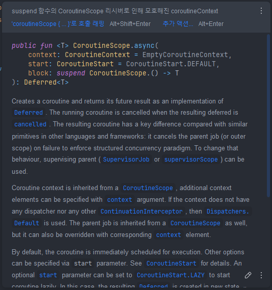

# 11장 코루틴 스코프 함수

### 📌 GlobalScope (지양)

```kotlin
@DelicateCoroutinesApi
public object GlobalScope : CoroutineScope {
    /**
     * Returns [EmptyCoroutineContext].
     */
    override val coroutineContext: CoroutineContext
        get() = EmptyCoroutineContext
}
```

- 두 개의 중단 함수를 동시에 실행하려면 async로 래핑해야 한다. 하지만 async는 코루틴 스코프가 필요하며 GlobalScope를 사용하는 것은 좋지 않다.

```kotlin
val user = GlobalScope.async { getUserData() }
```

- GlobalScope는 그저 EmptyCoroutineContext를 가진 스코프로, 스코프에서 async를 호출하면 부모 코루틴과 아무런 관계가 없다. 이때 async 코루틴은
    - 취소 될 수 없다 (부모가 취소되도 async 내부의 함수가 실행 중인 상태가 되어 작업이 끝날 때까지 자원이 낭비 됨
    - 부모로부터 스코프를 상속받지 않는다 (항상 기본 디스패처에서 실행되며, 부모의 Context를 전혀 신경쓰지 않는다.
    - 메모리 누수가 발생할 수 있으며 쓸대없이 CPU를 낭비한다.
    - 코루틴을 단위 테스트하는 도구가  작동하지 않아 테스트하기 아주 어렵다.
- 스코프를 인자로 넘긴다면 어떨까

```kotlin
// 이렇게 구현하면 안된다
suspend fun getUserProfile(
    scope: CoroutineScope
): UserProfileData {
    val user = scope.async { getUserData() }
    // ...
}

or

suspend fun CoroutineScope.getUserProfile(): UserProfileData {
    val user = async { getUserData() }
    // ...
}
```

- 이 방법은 취소가 가능하며 적절한 단위 테스트 또한 가능하여 좀 더 나은 방법이라고는 할 수 있다. 문제는 스코프가 함수로 전달되어야 한다는 점이다.
- 스코프가 함수로 전달되면 스코프에서 예상하지 못한 부작용이 발생할 수 있다. 예를 들면, async에서 예외가 발생하면 모든 스코프가 닫히게 된다. (일반적인 Job()으로 가정)
- 또한 스코프에 접근하는 함수가 cancel 메서드를 사용해 취소하는 동안 스코프를 조작할 수도 있다.

```kotlin
data class Details(
    val name: String,
    val followers: Int
)
data class Tweet(
    val text: String
)

fun getFollowersNumber(): Int = throw Error("Service exception")

suspend fun getUserName(): String {
    delay(500)
    return "ppeper"
}

suspend fun getTweets(): List<Tweet> {
    return listOf(Tweet("Hello, Coroutines"))
}

suspend fun CoroutineScope.getUserDetails(): Details {
    val userName = async { getUserName() }
    val followersNumber = async { getFollowersNumber() }
    return Details(userName.await(), followersNumber.await())
}

fun main(): Unit = runBlocking {
    val details = try {
        getUserDetails()
    } catch (e: Error) {
        null
    }
    val tweets = async { getTweets() }
    println("User: $details")
    println("Tweets: ${tweets.await()}")
}
// Exception in thread "main" java.lang.Error: Service exception... 만 발생
```

- getFollowersNumber() 함수에서 발생한 에러가 async를 종료하여 전체 스코프 (runBlocking) 이 종료되는 것으로 이어져 프로그램이 끝나 버리게 된다.
- IDE에서는 친철하게 이렇게 인자, 확장함수로 구현하게 되면 warning을 만들어주고 coroutineScope로 감쌀 수 있게 해준다.



### 📌 coroutineScope

- coroutineScope는 스코프를 시작하는 중단 함수이며, 인자로 들어온 함수가 생성한 값을 반환한다.

```kotlin
public suspend fun <R> coroutineScope(block: suspend CoroutineScope.() -> R): R
```

- async나 launch와는 다르게 coroutineScope의 본체는 리시버 없이 곧바로 호출된다. coroutineScope 함수는 새로운 코루틴을 생성하지만 새로운 코루틴이 끝날 때까지 coroutineScope를 호출한 코루틴을 중단하기 때문에 호출한 코루틴이 작업을 동시에 시작하지는 않는다.

```kotlin
fun main() = runBlocking {
    val a = coroutineScope {
        delay(1000)
        10
    }
    println("a is calculated")
    val b = coroutineScope {
        delay(1000)
        20
    }
    println(a)
    println(b)
}
// (1초 후)
// a is calculated
// (1초 후)
// 10
// 20
```

- 생성된 스코프는 바깥의 스코프에서 coroutineContext를 상속받지만 Context의 Job을 오바라이딩한다. 따라서 생성된 스코프는 부모가해야 할 책임을 이어 받는다.
    - 부모로부터 Context를 상속받는다.
    - 자신의 작업을 끝내기 전까지 모든 자식을 기자인다.
    - 부모가 취소되면 자식들 모두를 취소한다.
- 다음 예시에서는 coroutineScope는 모든 자식이 끝날 때까지 종료되지 않으므로 “After”가 마지막에 출력되는 것을 볼 수 있다. 또한 CoroutineName이 부모에서 자식으로 전달되는 것도 확인할 수 있다.

```kotlin
suspend fun longTask() = coroutineScope {
    launch {
        delay(1000)
        val name = coroutineContext[CoroutineName]?.name
        println("[$name] Finished task 1")
    }
    launch {
        delay(2000)
        val name = coroutineContext[CoroutineName]?.name
        println("[$name] Finished task 2")
    }
}

fun main(): Unit = runBlocking(CoroutineName("Main")) {
    println("Before")
    longTask()
    println("After")
}
// Before
// [Main] Finished task 1
// [Main] Finished task 2
// After
```

### 📌 코루틴 스코프 함수

| 코루틴 빌더 (runBlocking 제외)             | 코루틴 스코프 함수                                                |
|-------------------------------------|-----------------------------------------------------------|
| launch, async, produce              | coroutineScope ,supervisorScope ,withContext ,withTimeout |
| CoroutineScope의 확장 함수               | 중단 함수                                                     |
| CoroutineScope 리시버의 코루틴 Context를 사용 | 중단 함수의 Continuation 객체가 가진 코루틴 Context를 사용                |
| 예외는 Job을 통해 부모로 전파됨                 | 일반 함수와 같은 방식으로 예외를 던짐                                     |
| 비동기인 코루틴을 시작함                       | 코루틴 빌더가 호출된 곳에서 코루틴을 시작함                                  |

### 📌 withContext

- withContext 함수는 coroutineScope와 비슷하지만 스코프의 Context를 변경 할 수 있다는 점이 다르다. withContext의 인자로 Context를 제공하면 부모 스코프의 Context를 대체한다.

```kotlin
fun CoroutineScope.log(text: String) {
    val name = coroutineContext[CoroutineName]?.name
    println("[$name] $text")
}

fun main(): Unit = runBlocking(CoroutineName("Main")) {
		log("Before")

    withContext(CoroutineName("Child 1")) {
        delay(1000)
        log("Hello 1")
    }

    withContext(CoroutineName("Child 2")) {
        delay(1000)
        log("Hello 2")
    }

    log("After")
}
// [Main] Before
// [Child 1] Hello 1
// [Child 2] Hello 2
// [Main] After
```

### 📌 supervisorScope

- coroutineScope와 다르게 supervisorScope 함수는 Job을 SupervisorJob으로 오버라이딩 하는 것으로 자식 코루틴이 예외를 전지더라도 취소되지 않는 차이점이 있다.
- supervisorScope는 서로 독립적인 작업을 시작하는 함수에서 주로 사용된다.

```kotlin
suspend fun notifyAnalytics(actions: List<UserAction> =
    supervisorScope {
        actions.forEach { action ->
            launch {
                notifyAnalytics(action)
            }
        }
    }
```

- async를 사용하면 예외가 부모로 전파되는 것을 막는 것 이외에 추가적인 예외처리가 필요하다. await를 호출하고 async 코루틴이 예외로 끝나게 된다면 await는 예외를 다시 던지게 된다. 따라서 async에서 발생하는 예외를 전부 처리하려면 try-catch 블록으로 await 호출을 해핑해야 한다.

### 📌 withTimeout

- 이 함수에 아주 큰 타임아웃 값을 넣어주면 coroutineScope와 다를 것이 없다. 실행하는 데 시간이 너무 오래 걸리면 람다식은 취소되고 (CancellationException의 서브 타입인) `TimeoutCancellationException`을 던진다.

```kotlin
suspend fun test(): Int = withTimeout(1500) {
    delay(1000)
    println("Still thinking")
    delay(1000)
    println("Done!")
    42
}

fun main(): Unit = runBlocking(CoroutineName("Main")) {
    try {
        test()
    } catch (e: TimeoutCancellationException) {
        println("Cancelled")
    }
    delay(1000)
}
// Still thinking
// Cancelled
```

- withTimeout 함수는 테스트할 때 유용하다. 특정 함수가 시간이 많게, 혹은 적게 걸리는지 확인하는 테스트 용도로 사용된다.
- withTimeoutOrNull 은 래핑 함수에서 걸리는 시간이 너무 길 때 무언가 잘못되었을을 알리는 용도로 사용될 수 있다.

### 📌 코루틴 스코프 함수 연결하기

- 서로 다른 코루틴 스코프 함수의 두 가지 기능이 모두 필요하다면 모두를 설정하여 사용할 수 있다.

```kotlin
suspend fun calculateAnswerOrNull(): User? {
    withContext(Dispatchers.Default) {
            withTimeoutOrNull(1000) {
                    calculateAnswer()
            }
    }
```

### 📌 추가적인 연산

- 작입을 수행하는 도중에 추가적인 연산을 하는 경우 동일한 스코프에서 launch를 호출하는 방법이 자주 사용된다.

```kotlin
class ShowUserDataUseCase(
    private val repo: UserDataRepository,
    private val view: UserDataView
) {
    suspend fun showUserData() = coroutineScope {
        val name = async { repo.getName() }
        val friends = async { repo.getFriends() }
        val profile = async { repo.getProfile() }
        val user = User(
            name = name.await(),
            friends = friends.await(),
            profile = profile.await(),
        )
        view.show(user)
        launch { repo.notifyProfileShown() }
    }
}
```

- 이 방식에는 몇가지 문제가 있다. 먼저 coroutineScope가 사용자 데이터를 보여 준 뒤 launch로 시작된 코루틴이 끝나기를 기다려하므로 launch에서 함수의 목적돠 관련된 유의미한 작업을 한다고 보기 어렵다.
- 또한 뷰를 업데이트할때 progress bar를 보여 주고 있다면 notifyProfileShown이 끝날 때까지 기다려야한다.

```kotlin
fun onCreate() {
    viewModelScope.launch {
        _progressBar.value = true
        showUserData()
        _progressBar.value = false
    }
}
```

- 두 번째 문제는 취소다. 코루틴은 예외가 발생했을 때 다른 연산을 취소하게 설계되어 있다.
- getProfile에서 예외가 발생하면 getName, getFriends 또한 응답이 쓸모가 없어지기 때문에 취소가 되어야 한다. 하지만 분석을 위한 호출이 실패했다고 해서 전체 과정이 취소되는것은 말도 안되는 일이다.
- 이런 경우 핵심 동작에 영향을 주지 않는 추가적인 연산이 있는 경우 또 다른 스코프에서 시작하는 편이 낫다.

```kotlin
val analyticsScope = CoroutineScope(SupervisorJob())

class ShowUserDataUseCase(
    private val repo: UserDataRepository,
    private val view: UserDataView,
    private val analyticsScope: CoroutineScope
) {
    suspend fun showUserData() = coroutineScope {
        val name = async { repo.getName() }
        val friends = async { repo.getFriends() }
        val profile = async { repo.getProfile() }
        val user = User(
            name = name.await(),
            friends = friends.await(),
            profile = profile.await(),
        )
        view.show(user)
        // 독립적이게 실행
        analyticsScope.launch { repo.notifyProfileShown() }
    }
}
```