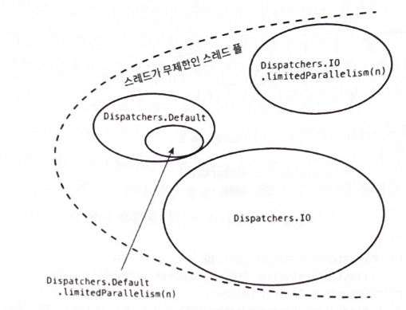

# 12장 디스패처

### 📌 기본 Dispatcher

- 디스패처를 설정하지 않으면 기본은 CPU 집약적인 연산을 수행하도록 설계된 `DIspatchers.Default` 이다.
- 이 디스패처는 실행되는 컴퓨터의 CPU 개수와 동일한 수의 스레드 풀을 가지고 있다.  내부적으로 `최소 2개 이상`의 스레드 풀을 가지도록 설계되어 있다.

```kotlin
suspend fun main() = coroutineScope {
    repeat(1000) {
        launch {
            List(1000) { Random.nextLong() }.maxOrNull()
            val threadName = Thread.currentThread().name
            println("Running on thread: $threadName")
        }
    }
}
Running on thread: DefaultDispatcher-worker-4
Running on thread: DefaultDispatcher-worker-3
Running on thread: DefaultDispatcher-worker-8
Running on thread: DefaultDispatcher-worker-10
Running on thread: DefaultDispatcher-worker-9
Running on thread: DefaultDispatcher-worker-1
Running on thread: DefaultDispatcher-worker-8
Running on thread: DefaultDispatcher-worker-3
Running on thread: DefaultDispatcher-worker-9
Running on thread: DefaultDispatcher-worker-1
...
```

❗runBlocking은 디스패처가 설정되어 있지 않으면 자신만의 디스패처를 사용해 Dispatcher.Default가 자동으로 선택되지 않는다. 따라서 위 예제에서 runBlocking을 대신 사용하면 모든 ‘main’에서 실행된다.

### 📌 기본 Dispatcher 제한하기

- 비용이 많이 드는 작업이 DIspatchers.Default의 스레드를 다 써버려서 같은 디스패처를 사용하는 다른 코루틴이 실행될 기회를 제한하고 있다고 해보자. 이런 상황에선 `limitedParallelism` 함수를 사용하면 디스패처가 같은 스레드 풀을 사용하지만 같은 시간에 특정 수 이상의 스레드를 사용하지 못하게 제한할 수 있다.

```kotlin
private val dispatcher = Dispatchers.Default
    .limitedParallelism(5)
```

- 이는 Default 이회에 다른 디스패처에서도 스레드 수를 제한할 수 있어 해당 함수를 기억하는 것이 좋다.

💡limitedParallelism은 kotlinx.coroutines 1.6버전에서 도입되었다

### 📌 Main Dispatcher

- 일반적으로 안드로이드를 포함한 애플리케이션 프레임워크는 가장 중요한 스레드인 메인 또는 UI 스레드 개념을 가지고 있다.
- 메인 스레드는 자주 사용되지만 블로킹이 되면 전체 애플리케이션이 멈추기 때문에 조심스럽게 사용해야 한다. 코루틴에선 `Dispatchers.Main` 을 사용하면 된다.

```kotlin
@OptIn(ExperimentalCoroutinesApi::class)
class SomeTest {

    private val dispatcher = Executors
        .newSingleThreadExecutor()
        .asCoroutineDispatcher()

    @Before
    fun setup() {
        Dispatchers.setMain(dispatcher)
    }

    @After
    fun tearDown() {
        // 메인 디스패처를 원래의 Main 디스패처로 되돌린다.
        Dispatchers.resetMain()
        dispatcher.close()
    }

    fun testSomeUI() = runBlocking {
        launch(Dispatchers.Main) { 
            // ...
        }
    }
}
```

### 📌 IO Dispatcher

- DIspatchers.IO는 파일의 입출력, 안드로이드 내부 데이터베이스(shared preference, room)을 사용하는 경우, 블로킹 함수를 호출하는 경우 처럼 I/O 연산으로 스레드를 블로킹할 때 사용하기 위해 설계되었다
- IO 디스패처는 내부적으로 `최소 64개`로로 제한 된다. (더 많은 코어가 있다면 해당 코어의 수)

```kotlin
suspend fun main() {
    val time = measureTimeMillis {
        coroutineScope {
            repeat(50) {
                launch(Dispatchers.IO) {
                    Thread.sleep(1000)
                    val threadName = Thread.currentThread().name
                    println("Running on thread: $threadName")
                }
            }
        }
    }
    println(time)
}
Running on thread: DefaultDispatcher-worker-45
Running on thread: DefaultDispatcher-worker-47
Running on thread: DefaultDispatcher-worker-40
Running on thread: DefaultDispatcher-worker-29
Running on thread: DefaultDispatcher-worker-26
Running on thread: DefaultDispatcher-worker-24
Running on thread: DefaultDispatcher-worker-51
Running on thread: DefaultDispatcher-worker-22
...
1029
// (실행할 때마다 ~1000(1초) 소요됨)
```

- 여기서 50개가 넘는 스레드를 사용하도록 만들어도 최소 64개의 스레드 풀을 사용하기 때문에 sleep(1000)에 대한 1초정도만 쇼요되는 것을 볼 수 있다.
- 또한 Dispatchers.Default와 Dispatchers.IO는 같은 스레드 풀을 공유한다. 이는 최적화 측면에서 중요하다.
    - 스레드는 재사용되고 다시 배분될 필요가 없다. 따라서 Dispatchers.Default로 실행 도중 withContext(Dispatchers.IO) {…} 까지 도달한 경우 대부분 같은 스레드로 실행이 되지만 스레드 수가 Dispatchers.Default의 한도가 아닌 Dispatcher.IO의 한도로 적용된다.
- 이러한 Dispatchers.IO를 사용하는 가장 흔한 경우는 라이브러리에서 블로킬 함수를 호출하는 것이다. 하지만 Dispatchers.IO의 스레드는 64개로 제한되어 이보다 횔씬 많은 수의 스레드를 블로킹하는 서비스는 자기 차례가 돌아올 때까지 스레드 전부를 기다리게 만든다. 이런 경우 limitedParallelism을 활용할 수 있다.

### 📌 Custom 스레드 풀을 사용하는 IO Dispatcher

- Dispatchers.IO에는 limitedParallelism 함수를 위해 정의된 특별한 작동 방식이 있다. limitedParallelism 함수는 독립적인 스레드 풀을 가진 새로운 디스패처를 만든다.
- 만들어진 풀은 우리가 원하는 만큼 많은 수의 스레드 수를 설정할 수 있어 스레드 수가 64개로 제안되지 않는다.

```kotlin
suspend fun main(): Unit = coroutineScope {
    launch {
        printCoroutinesTime(Dispatchers.IO)
        // Dispatchers.IO took: 2014
    }
    launch {
        val dispatcher = Dispatchers.IO
            .limitedParallelism(100)
        printCoroutinesTime(dispatcher)
        // Dispatchers.IO.limitedParallelism(100) took: 1028
    }
}
```

- 100개의 코루틴을 각각 스레드 1초씩 블로킹하는 위의 에시에서 Dispatchers.IO에서 실행하면 2초가 걸리지만 동일한 동작을 limitedParallelism으로 100개의 스레드를 사용하는 Dispatchers.IO에서 실행하면 1초가 걸린다
- Dispatchers.Default와 Dispatchers.IO 에서의 차이점은 아래와 같다



### 📌 정해진 수의 스레드 풀을 가진 Dispatcher

- 스레들 풀을 직접 관리하기를 원하면 Executors 클래스를 스레드의 수가 정해져 있는 스레드 풀이나 캐싱된 스레드 풀을 만들 수 있다. 이렇게 만들어진 스레드 풀은 ExcecutorService나 Executor 인터페이스를 구현하며, asCoroutineDispatcher 함수를 이용해 변형하는 것도 가능하다.

```kotlin
val NUMBER_OF_THREADS = 20
val dispatcher = Executors
	.newFixedThreadPool(NUMBER_OF_THREADS)
	.asCoroutineDispatcher()
```

- ExecutorServie.asCoroutineDispatcher()로 만들어진 디스패처의 가장 큰 문제점은 `close` 함수로 닫혀야 한다는 점이다. 또 다른 문제는 정해진 수의 스레드 풀을 만들면 스레드를 효율적으로 사용하지 않는다는 것이다.

### 📌 싱글스레드로 제한된 Dispatcher

- 다수의 스레드를 사용하는 모든 디스패처에서는 `공유 상태` 로 인한 문제를 생각해야 한다. 간단한 예시로 10000개의 코루틴이 i를 1씩 증가시키는 상황에서는 다수의 스레드가 공유 상태이기 때문에 실제로는 더 작은 값을 가진다.

```kotlin
var i = 0
suspend fun main(): Unit = coroutineScope {
    repeat(10000) {
        launch(Dispatchers.IO) {
            i++
        }
    }
    delay(1000)
    println(i)
}
// ~9852
```

- 가장 간단히 해결살 수 있는 방법은 싱글스레드를 가진 디스패처를 가지는 방법이 있다. 하지만 디스패처가 스레드 하나를 액티브한 상태를 유지하고 있으며, 더 이상 사용되지 않을 때 스레드를 반드시 닫아야 한다는 문제점이 있다.
- 최근에는 Dispatchers.Default나 병렬 처리를 1로 제한한 Dispatchers.IO를 주로 사용한다.

```kotlin
val dispatcher = Executors.newSingleThreadExecutor()
    .asCoroutineDispatcher()
    
or

val dispatcher = Dispatchers.Default
    .limitedParallelism(1)
    
suspend fun main(): Unit = coroutineScope {
    repeat(10000) {
        launch(dispatcher) {
            i++
        }
    }
    delay(1000)
    println(i)
}
// 10000
```

- 하지만 하나의 스레드만 가지고 있기 때문에 이 스레드가 블로킹되면 작업이 순차적으로 처리되는 것이 가장 큰 단점이다.

```kotlin
suspend fun main(): Unit = coroutineScope {
    val dispatcher = Dispatchers.Default
        .limitedParallelism(1)
    val job = Job()
    repeat(5) {
        launch(dispatcher + job) {
            Thread.sleep(1000)
        }
    }
    job.complete()
    val time = measureTimeMillis { job.join() }
    println("$time")
}
/ ~5026 (순차적으로 5초가 걸림)
```

### 📌 프로젝트 룸의 가상 스레드 사용하기

### 📌 제한받지 않는 Dispatcher

- 마지막으로 `Dispatchers.Unconfined` 이다. 이 디스패처는 스레드를 바꾸지 않는다는 점에서 이전 디스패처들과 다르다.
- 제한 받지 않는 디스패처가 시작되면 시작한 스레드에서 실행 된다. 제한받지 않는 디스패처는 단위 테스트할 때 유용하다. 테스트 시 시간을 동기화하는 건 쉽지 않다. 이런 경우 Dispatchers.Unconfined로 다른 디스패처를 대체하여 사용할 수 있다.
- 모든 스코프에서 제한받지 않는 디스패처를 사용하면 모든 작업ㅇ ㅣ같은 스레드에서 실행되기 때문에 연산의 순서를 훨씬 쉽게 통제할 수 있다. 하지만 runTest를 사용하면 이런 방법은 필요하지 않다.
- 실행되는 스레드에 대해 전혀 신경쓰지 않아도 된다면 선택해도 되지만 개발자의 실수가 발생할 수 있기 때문에 하지 말아야한다.

### 📌 Main Dispatcher로 즉시 옮기기

- 코루틴을 배정하는 것에도 비용이 든다. withContext가 호출되면 코루틴은 중단되고 큐에서 기다리다가 재개된다.
- 스레드에서 이미 실행되고 있는 코루틴을 다시 배정하면 작지만 필요없는 비용이 든다고 할 수 있다.

```kotlin
suspend fun showUser(user: User) =
		withConext(Dispatchers.Main) {
				//...
		}
```

- 위 함수가 이미 메인 디스패처에서 호출이 되었다면 다시 배정하는데 쓸대 없는 비용이 발생한다. 게다가 메인 스레드를 기다리는 큐가 쌓여있다면 약간의 지연이 있은 뒤에 보여지게 된다.
- 이런 경우를 방지하기 위해 반드시 필요할 경우에만 배정을 하는 `Dispatchers.Main.immediate` 가 있다.

### 📌 Continuation Interceptor

- 디스패칭은 코틀린 언어에서 지원하는 Continuation Interceptor을 기반으로 작동하고 있다. ContinuationInterceptor라는 코루틴 Context는 코루틴이 중단되었을 때 `interceptContinuation` 메서드로 Continuation 객체를 수정하고 포장한다. `releaseInterceptedContinuation` 메서드는 Continuation이 종료되었을 때 호출된다.

```kotlin
@SinceKotlin("1.3")
public interface ContinuationInterceptor : CoroutineContext.Element {
    /**
     * The key that defines *the* context interceptor.
     */
    public companion object Key : CoroutineContext.Key<ContinuationInterceptor>

    /**
     * Returns continuation that wraps the original [continuation], thus intercepting all resumptions.
     * This function is invoked by coroutines framework when needed and the resulting continuations are
     * cached internally per each instance of the original [continuation].
     *
     * This function may simply return original [continuation] if it does not want to intercept this particular continuation.
     *
     * When the original [continuation] completes, coroutine framework invokes [releaseInterceptedContinuation]
     * with the resulting continuation if it was intercepted, that is if `interceptContinuation` had previously
     * returned a different continuation instance.
     */
    public fun <T> interceptContinuation(continuation: Continuation<T>): Continuation<T>

    /**
     * Invoked for the continuation instance returned by [interceptContinuation] when the original
     * continuation completes and will not be used anymore. This function is invoked only if [interceptContinuation]
     * had returned a different continuation instance from the one it was invoked with.
     *
     * Default implementation does nothing.
     *
     * @param continuation Continuation instance returned by this interceptor's [interceptContinuation] invocation.
     */
    public fun releaseInterceptedContinuation(continuation: Continuation<*>) {
        /* do nothing by default */
    }
```

- Continuation 객체를 래핑할 수 있다는 것은 다양한 방법으로 제어할 수 있다는 것을 의미한다. 디스패처는 특정 스레드 풀에서 실행되는 DispatchedContinuation으로 Continuation 객체를 래핑하기 위해 interceptContinuation을 사용한다. DispatchedContinuation은 디스패처가 작동하는 핵심 요소이다.