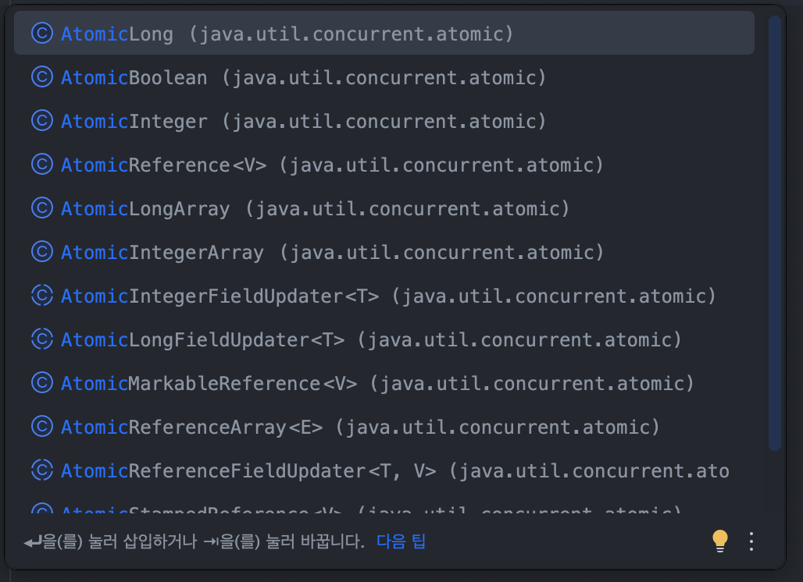

# 14장 공유 상태로 인한 문제

### 📌 동기화 블로킹

- 위와 같은 문제는 자바에서 사용되는 전통적인 도구인 `synchronized` 블록이나 동기화된 컬렉션을 사용해 해결 할 수 있다.

```kotlin
var counter = 0

suspend fun massiveRun(action: suspend () -> Unit) {
    withContext(Dispatchers.Default) {
        repeat(1000) {
            launch {
                repeat(1000) { action() }
            }
        }
    }
}
fun main() = runBlocking {
    val lock = Any()
    massiveRun {
        synchronized(lock) { // 스레드를 블로킹한다.
            counter++
        }
    }
    println(counter)
}
// 1000000
```

- 이 방법의 문제점은 syncronized 블록 내부에서 중단 함수를 사용할 수 없다는 것이다. 두 번째는 블록에서 코루틴이 자기 차례를 기다릴 때 스레드를 블로킹 한다는 것이다.
- 따라서 블로킹 없이 중단하거나 충돌을 회피하는 방법을 사용해야 한다.

### 📌 원자성

- 자바에는 간단한 경우에 사용할 수 있는 방법이 있다. 자바는 다양한 원자값을 가지고 있다. 원자값을 활용한 연산은 빠르며 ‘스레드 안전’ 을 보장한다. 이러한 연산을 원자성 연산이라 한다.



```kotlin
private var counter = AtomicInteger()

fun main() = runBlocking {
    massiveRun {
        counter.incrementAndGet()
    }
    println(counter.get()) // 1000000
}
```

- 원자값은 의도대로 잘 동작하지만 사용성이 제한되기 때문에 조심해서 사용해야한다. 하나의 연산에서 원자성을 가지고 있다고 해서 전체 연산에서 원자성이 보장되는 것은 아니다.

```kotlin
private var counter = AtomicInteger()

fun main() = runBlocking {
    massiveRun {
        counter.set(counter.get() + 1)
    }
    println(counter.get()) // ~269370
}
```

### 📌 싱글스레드로 제한된 디스패처

- 이전에 살펴본 병렬성 (limitedParallelism(1)) 을 하나의 스레드로 제한하는 디스패처는 간단한  방법중 하나다.
- 두 가지 방법으로 디스패처를 사용할 수 있다.
    - 첫 번째 방법은 **코스 그레인드 스레드 한정(coarse-grained thread confinement)** 으로 알려져 있다.
        - 이 방법은 디스패처를 싱글스레드로 제한한 withContext로 전체 함수를 래핑하는 방법이다. 이는 사용하기 쉽고 충돌을 방지할 수 있지만, 함수 전체에서 멀티스레딩의 이점을 누리지 못하는 문제가 있다.

        ```kotlin
        class UserDownloader(
            private val api: NetworkService
        ) {
            private val users = mutableListOf<User>()
        	private val dispatcher = Dispatchers.IO
                .limitedParallelism(1)
        		
        	suspend fun downloaded(): List<User = withContext(dispatcher) {
                    users.toList()
                }
        		
        	suspend fun fetchUser(id: Int) = withContext(dispatcher) { 
                    val newUser = api.fetchUser(id)
                    users += newUser 
                }
        }
        ```

        - 위 fetchUser(id)는 여러 개의 스레드에서 병렬로 시작할 수 있지만 함수 본체는 싱글스레드로 제한되어 실행된다. 그 결과, 블로킹되는 함수 또는 CPU 집약적인 함수를 호출하면 실행이 느려지게 된다.
    - 두 번째 방법은 **파인 그레인드 스레드 한정(fine-grained thread confinement)** 으로 알려져 있다.
        - 이 방법은 상태를 변경하는 구문들만 래핑하는 것이다. 위 예제에서는 users를사용하는 모든 줄을 말한다. 이는 좀 더 번거롭지만 크리티컬 섹션이 아닌 부분이 블로킹되거나 CPU 집약적인 경우에 더 나은 성능을 제공한다.

        ```kotlin
        class UserDownloader(
        	private val api: NetworkService
        ) {
            private val users = mutableListOf<User>()
        	private val dispatcher = Dispatchers.IO
                .limitedParallelism(1)
        		
        	suspend fun downloaded(): List<User =
        		withContext(dispatcher) { 
                    users.toList()
                }
        		
        	suspend fun fetchUser(id: Int) {
                val newUser = api.fetchUser(id)
        		withContext(dispatcher) {
                    users += newUser 
                }
            }
        }
        ```


### 📌 Mutex

- 마지막은 가장 인기 있는 방식인 Mutex를 사용하는 것이다. 뮤텍스는 단 하나의 열쇠가 있는방이라고 생각하면 된다.
- Mutex의 가장 중요한 기능인 lock이다. 이는 단 하나의 코루틴만이 lock과 unlock 사이에 있을 수 있다.

```kotlin
val mutex = Mutex()

suspend fun delayAndPrint() {
    mutex.lock()
    delay(1000)
    println("Done")
    mutex.unlock()
}

suspend fun main() = coroutineScope {
    repeat(5) {
        launch {
            delayAndPrint()
        }
    }
}
```

- lock과 unlock을 직접 사용하는 건 위험한데, 두 함수 사이에서 예외가 발생할 경우 열쇠를 돌려받을 수 없으며, 그 결과 다른 코루틴이 lock을 통과할 수 없게 된다.
- 이는 데드락이라고 알려진 심각한 문제다.

### 📌 Semaphore

- Mutex와 비슷한 방식으로 작동하지만 둘 이상이 접근할 수 있고, 사용법이 다른 Semaphore도 알야한다.
- Mutex는 하나의 접근만 허용하므로, lock, unlock, withLock 함수를 가지고 있다.
- Semaphore는 여러 개의 접근을 허용하므로, acquire,release, withPermit 함수를 가지고 있다.

```kotlin
suspend fun main() = coroutineScope {
    val semaphore = Semaphore(2)

    repeat(5) {
        launch {
            semaphore.withPermit {
                delay(1000)
                print(it)
            }
        }
    }
}
// 01 (1초후) 23 (1초후) 4
```

- Semaphore는 공유 상태로 인해 생기는 문제를 해결할 수는 없지만, 동시 요청을 처리하는 수를 제한할 때사용할 수 있어 **처리율 제한 장치(rate limiter)** 를 구현할 때 도움이 된다.