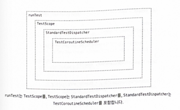

# 15장 코틀린 코루틴 테스트하기

### 📌 시간 의존성 테스트하기

- 시간 의존성 테스트를 할때는 기존 테스트와 다른 점이 발생한다.

```kotlin
suspend fun produceCurrentUserSeq(): User {
    val profile = repo.getProfile()
    val friends = repo.getFriends()
    return User(profile, friends)
}

suspend fun produceCurrentUserSym(): User = coroutineScope {
    val profile = async { repo.getProfile() }
    val friends = async { repo.getFriends() }
    return User(profile.await(), friends.await())
}
```

- 두 함수는 같은 결과를 만들지만 첫 번째 함수는 순차적, 두 번째 함수는 동시에 생성한다는 점이 다르다.
- 프로필과 친구들을 가지고 오는 함수가 각각 1초씩 걸린다면 첫 번째 함수는 2초 정도, 두 번째 함수는 1초정도 걸리는 차이가 있다.
    - 이러한 함수의 데이터를 가지고 오는 광정에서 지연되는 상황을 만들기 위해 delay를 사용하여 가짜 함수를 지연시킬 수 있다.

    ```kotlin
    class FakeDelayedUserDataRepository: UserDataRepository {
        override suspend fun getProfile(): Profile {
                delay(1000)
                return Profile("Test")
        }
        override suspend fun getFriends(): List<Friend> {
                delay(1000)
                return listOf(Friend("Friend1"))
        }
    }
    ```

    - 이렇게 delay를 통해 단위 테스트를 진행하면 그 차이를 확인할 수 있다. 하지만 하나의 단위 테스트에서 시간이 오래 걸리는 것은 문제가 된다.
    - 코루틴에서는 시간을 조작하여 테스트에 걸리는 시간을 줄일 수 있다. `kotlinx-coroutines-test` 라이브러리가 제공하는 **StandardTestDispatcher** 를 사용하면 된다.

### 📌 TestCoroutineScheduler와 StandardTestDispatcher

- TestCoroutineScheduler는 delay를 가상 시간 동안 실행하여 실제 시간이 흘러간 상황과 동일하게 작동하기 때문에 실제 정해진 시간만큼 기다리지 않도록 할 수 있다.

> 💡StandardTestDispatcher, TestScope, runTest처럼 TestCoroutineScheduler도 아직 정식으로 도입되지는 않았다고 한다.

```kotlin
import kotlinx.coroutines.ExperimentalCoroutinesApi
import kotlinx.coroutines.test.TestCoroutineScheduler

@OptIn(ExperimentalCoroutinesApi::class)
fun main() {
    val scheduler = TestCoroutineScheduler()

    println(scheduler.currentTime) // 0
    scheduler.advanceTimeBy(1000)
    println(scheduler.currentTime) // 1000
    scheduler.advanceTimeBy(1000)
    println(scheduler.currentTime) // 2000
}
```

- 코루틴에서 TestCoroutineScheduler를 사용하기 위해 일반적으로 StandardTestDispatcher를 사용한다.
- 이는 다른 디스패처와 달리, 코루틴을 실행되어야 할 스레드를 결정할 때만 사용되는 것은 아니다. 테스트 디스패처로 시작된 코루틴은 가상 시간만큼 진행되기 전까지 실행되지 않는다.
- 코루틴을 시작하는 일반적인 방법은, 실제 시간처럼 작동하는 가상 시간을 흐르게 하여, 그 시간동안 호출되었을 때 모든 작업을 실행하는 `advanceUntilIdle` 을 사용하는 것이다.
- 기본적으로 StandardTestDispatcher 는 TestCoroutineScheduler를 만들기 때문에 명시적으로 만들지 않아도 된다.

    ```kotlin
    val scheduler = TestCoroutineScheduler()   
    val testDispatcher = StandardTestDispatcher(scheduler)
    == 
    val dispatcher = StandardTestDispatcher()
    ```


```kotlin
fun main() {
    val dispatcher = StandardTestDispatcher()
		

    CoroutineScope(dispatcher).launch {
        println("Some work1")
        delay(1000)
        println("Some work2")
        delay(1000)
        println("Coroutine done")
    }
    println("[${dispatcher.scheduler.currentTime}] Before")
    dispatcher.scheduler.advanceUntilIdle()
    println("[${dispatcher.scheduler.currentTime}] After")
}
// 즉시 출력됨 (가상 시간)
// [0] Before
// Some work1
// Some work2
// Coroutine done
// [2000] After
```

- 주의 할점은 StandardTestDispatcher는 직접 시간을 흐르게 하지 않아, 시간이 흐르지 않게 된다면 코루틴이 다시 재개되지 않는다.
- 시간을 흐리게 하는 다른 방법은 `advanceTimeBy` 에 일정 밀리초를 인자로 넣는 것이다. 이 함수는 시간을 흐르게 하고 그동안 일어났을 모든 연산을 수행한다. 지정한 밀리초와 정확히 일치하는 시간에 예정된 연산을 재개하려면 `runCurrent` 함수를 추가로 호출하면 된다.

```kotlin
fun main() {
    val testDispatcher = StandardTestDispatcher()

    CoroutineScope(testDispatcher).launch {
        delay(1)
        println("Done1")
    }
    CoroutineScope(testDispatcher).launch {
        delay(2)
        println("Done2")
    }
    testDispatcher.scheduler.advanceTimeBy(2)
    testDispatcher.scheduler.runCurrent()
}
```

- 같은 역할을 수행하는 TestScope를 사용할 수 있다. 스코프가 사용하는 스캐쥴러에 advanceUntilIdle, advanceTimeBy 또는 currentTIme 프로퍼치가 위임되기 때ㅜㅁㄴ에 스코프 만으로도 해당 함수와 프로퍼티를 사용할 수 있어 편리하다.

```kotlin
@OptIn(ExperimentalCoroutinesApi::class)
fun main() {
    val scope = TestScope()

    scope.launch {
        delay(1000)
        println("First done")
        delay(1000)
        println("Coroutine done")
    }

    println("[${scope.currentTime}] Before")
    scope.advanceTimeBy(1000)
    scope.runCurrent()
    println("[${scope.currentTime}] Middle")
    scope.advanceUntilIdle()
    println("[${scope.currentTime}] After")
}
// [0] Before
// First done
// [1000] Middle
// Coroutine done
// [2000] After
```

- 안드로이드 ViewModel, Presenter, Fragment를 테스트할때 StandardTestDispatcher를 자주 사용하는 걸 볼 수 있다. 하지만 이런 방법은 복잡하기 때문에 같은 목적으로 설계된 `runTest` 를 대신 사용해야 한다.

### 📌 runTest

- runTest는 TestScope를 사용하므로 아무 때나 currentTime을 사용할 수 있다.

```kotlin
@OptIn(ExperimentalCoroutinesApi::class)
class RunTest {

    @Test
    fun test1() = runTest {
        assertEquals(0, currentTime)
        delay(1000)
        assertEquals(1000, currentTime)
    }

    @Test
    fun test2() = runTest {
        assertEquals(0, currentTime)
        coroutineScope {
            launch { delay(1000) }
            launch { delay(1500) }
            launch { delay(2000) }
        }
        assertEquals(2000, currentTime)
    }
}
```

- runTest를 통해 모든 클래스와 인터페이스의 코드와 함께 순차 처리하는 함수를 테스하는 예시를 확인해보자

```kotlin
data class User(
    val name: String,
    val friends: List<Friend>,
    val profile: Profile
)
data class Friend(val id: String)
data class Profile(val description: String)

interface UserDataRepository {
    suspend fun getName(): String
    suspend fun getFriends(): List<Friend>
    suspend fun getProfile(): Profile
}

class FakeUserDataRepository: UserDataRepository {
    override suspend fun getName(): String {
        delay(1000)
        return "ppeper"
    }

    override suspend fun getFriends(): List<Friend> {
        delay(1000)
        return listOf(Friend("Friend Dr"))
    }

    override suspend fun getProfile(): Profile {
        delay(1000)
        return Profile("Test Description")
    }
}

class FetchUserUseCase(
    private val repo: UserDataRepository
) {
    suspend fun fetchUserData(): User = coroutineScope { 
        val name = async { repo.getName() }
        val friends = async { repo.getFriends() }
        val profile = async { repo.getProfile() }
        User(
            name = name.await(),
            friends = friends.await(),
            profile = profile.await()
        )
    }
}

// Test
@OptIn(ExperimentalCoroutinesApi::class)
class FetchUserDataTest {

    @Test
    fun `should load data concurrently`() = runTest {
        // given
        val userRepo = FakeUserDataRepository()
        val useCase = FetchUserUseCase(userRepo)

        // when
        useCase.fetchUserData()
        
        // then
        assertEquals(1000, currentTime)

    }
    
    @Test
    fun `should construct user`() = runTest {
        // given
        val userRepo = FakeUserDataRepository()
        val useCase = FetchUserUseCase(userRepo)

        // when
        val result = useCase.fetchUserData()

        // then
        val expectedUser = User(
            name = "ppeper",
            friends = listOf(Friend("Friend Dr")),
            profile = Profile("Test Description")
        )
        assertEquals(expectedUser, result)
    }
}
```



### 📌 백그라운드 스코프

- runTest 함수는 다른 함수와 같이 스코프를 만들며, 자식 코루틴이 끝날 때까지 기다린다. 따라서 절대 끝나지 않는 프로세스를 시작한다면 테스트 또한 종료되지 않는다.
- 이런 경우를 대비해, runTest는 backgroundScope를 제공한다.
    - 백그라운드 스코프 또한 가상 시간을 지원하지만, runTest가 스코프가 종료될 때까지 기다리지 않는다.

```kotlin
@Test
fun `should increment counter`() = runTest {
    var i = 0
    backgroundScope.launch {
        while (true) {
            delay(1000)
            i++
        }
    }
    delay(1001)
    assertEquals(1, i)
    delay(1000)
    assertEquals(2, i)
}
```

### 📌 취소와 Context 전달 테스트하기

- 특정 함수가 구조화된 동시성을 지키고 있는지 테스트하려면, 중단 함수로부터 Context를 받은 뒤, Context가 기대한 값을 가지고 있는지와 Job이 적적할 상태인지 확인하는 것이 가장 쉬운 방법이다.

```kotlin
suspend fun <T, R> Iterable<T>.mapAsync(
    transformation: suspend (T) -> R
): List<R> = coroutineScope { 
    this@mapAsync.map { async { transformation(it) } }
        .awaitAll()
}

@Test
fun `should map async and keep elements order`() = runTest {
    val transform = listOf(
        suspend { delay(3000); "A" },
        suspend { delay(2000); "B" },
        suspend { delay(4000); "C" },
        suspend { delay(1000); "D" },
    )
    val result = transform.mapAsync { it() }
    assertEquals(listOf("A", "B", "C", "D"), result)
    assertEquals(4000, currentTime)
}
```

- 추가로 구조화된 동시성을 지키는 중단 함수가 정확하게 구현되어야 한다. 이를 확인하는 가장 쉬운 방법은 부모 코루틴에서 `CoroutineName` 과 같은 특정 Context를 명시하여 함수에서 그대로 인지 확인하는 것이다.

```kotlin
@Test
fun `should support context propagation`() = runTest {
    var ctx: CoroutineContext? = null
    val name1 = CoroutineName("Name 1")
    withContext(name1) {
        listOf("A").mapAsync {
            ctx = currentCoroutineContext()
            it
        }
        assertEquals(name1, ctx?.get(CoroutineName))
    }
    val name2 = CoroutineName("Name 2")
    withContext(name1) {
        listOf(1, 2, 3).mapAsync {
            ctx = currentCoroutineContext()
            it
        }
        assertEquals(name2, ctx?.get(CoroutineName))
    }
}
```

- 코루틴의 취소를 확인하고자 한다면 내부 함수에서 Job을 참조하고, 회부 코루틴에서 코루틴을 취소한 뒤 Job의 상태를 확인하면 된다.

```kotlin
@Test
fun `should support cancellation`() = runTest {
    var job: Job? = null
    val parentJob = launch {
        listOf("A").mapAsync {
            job = currentCoroutineContext().job
            delay(Long.MAX_VALUE)
        }
    }
    delay(1000)
    parentJob.cancel()
    assertEquals(true, job?.isCancelled)
}
```

### 📌 UnconfinedTestDispatcher

- StandardTestDispatcher 외에 UnconfinedTestDispatcher와의 차이점은 전자는 스캐쥴러를 사용하기 전까지 어떤 연산도 수행하지 않는다는 것이 가장 큰 차이점이다.
- UnconfinedTestDispatcher는 코루틴이 시작했을 때 첫 번째 지연이 일어나기 전까지 모든 연산을 즉시 수행한다.

```kotlin
@OptIn(ExperimentalCoroutinesApi::class)
fun main() {
    CoroutineScope(StandardTestDispatcher()).launch {
        println("A")
        delay(1)
        println("B")
    }
    // 출력 X
    
    CoroutineScope(UnconfinedTestDispatcher()).launch {
        println("C")
        delay(1)
        println("D")
    }
    // C가 출력
}
```

### 📌 목(Mock) 사용하기

- 가짜 객체에서 delay를 사용하기 쉽지만, 명학하게 드러나지 않는다. 따라서 많은 개발자는 테스트 함수에서 delay를 호출하는 것을 선호한다.
- [MocKK 라이브러리](https://github.com/mockk/mockk)를 활용하여 테스트 코드를 작성할 수 있다.

```kotlin
@OptIn(ExperimentalCoroutinesApi::class)
class Mockk {

    @Test
    fun `should load data concurrently`() = runTest {
        // given
        val userRepo = mockk<UserDataRepository>()
        coEvery { userRepo.getName() } coAnswers {
            delay(600)
            "ppeper"
        }
        coEvery { userRepo.getFriends() } coAnswers {
            delay(700)
            listOf(Friend("Friend Dr"))
        }
        coEvery { userRepo.getProfile() } coAnswers {
            delay(800)
            Profile("Test Description")
        }
        val useCase = FetchUserUseCase(userRepo)

        // when
        useCase.fetchUserData()

        // then
        assertEquals(800, currentTime)
    }
}
```

### 📌 디스패처를 바꾸는 함수 테스트하기

- 호출하는 함수를 모킹하여, 사용한 스레드의 이름을 가지고 오는 방법으로 테스트 할 수 있다.

```kotlin
@Test
fun `should change dispatcher`() = runTest { 
    // given
    val csvReader = mockk<CsvReader>()
    val startThreadName = "MyName"
    val usedThreadName: String? = null
    every {
        csvReader.readCsvBlocking(
                FILE_NAME,
                GameState::class.java
        )
    } coAnswers {
        usedThreadName = Thread.currentThread().name
        GAME_STATE
    }
    val saveReader = SaveReader(csvReader)
    
    // when
    withContext(newSingleThreadContext(startThreadName) {
        saveReader.readSave(FILE_NAME)
    }
            
    // then
    assertNotNull(usedThreadName)
    val expectedPrefix = "DefaultDispatcher-worker-"
    assert(usedThreadName!!.startWith(expectedPrefix))
}
```

- 디스패처를 바꾸는 함수에서 시간 의존성을 테스트해야하는 드문 경우가 있다. 이때 새로운 디스패처가 StandardTestDispatcher를 대체하면 가상 시간에서의 작동을 멈추가 된다.
- 이러한 가상 시간 문제를 해결하는 가장 쉬운 방법은 **생성자를 통해 디스패처를 주입** 하고 단위 테스트에서 디스패처를 교체하는 것이다.

```kotlin
class FetchUserUseCase(
    private val repo: UserDataRepository,
    private val isDispatcher: CoroutineDispatcher = Dispatchers.IO
) {
    ...
}

val testDispatcher = this
    .coroutineContext(ContinuationInterceptor)
    as CoroutineDispatcher

val useCase = FetchUserUseCase(
    userRepo = userRepo,
    isDispatcher = testDispatcher
)
```

### 📌 함수 실행 중에 일어나는 일 테스트하기

- 실행 중 프로그래스 바를 먼저 보여주고 나중에 숨기는 함수가 있다고 하자. 최종 결과만 확인하면 함수 실행 중에 프로그래스 바가 상태를 변경했는지 확인할 방법이 없다.
- runTest는 코루틴의 디스패처로 StandardTestDispatcher를 지정하며 대기 상태가 될 때까지 `advanceUntilIdle` 함수를 사용해 시간을 흐르게 한다.
- 이를 통해자식 코루틴의 시간은 부모가 자식을 기다리기 시작할 때, 즉 함수 본체의 실행이 끝냈을 때가 되서야 흐르게 되며, 이전에는 가상 시간을 조정할 수 있다.

### 📌 메인 디스패처 교체하기

- 단위 테스트에는 메인 함수가 없다. 메인 함수를사용하려고하면, 테스트는 ‘메인 디스패처를 가진 모율이 없다’는 예외를 던지며 실패한다.
- 매번 메인 스레드를 주입하는 건 비용이 많이 들어, 코루틴 테스트 라이브러리에선 Dispatchers에 `setMain` 확장 함수를 제공한다.
- 모든 단위 테스트에 의해 확장되는 기본 클래스의 `setup` 함수(@Before, @BeforeEach가 붙은 함수) 에서 메인 함수를 설정할 때가 많다. 이렇게 하면 코루틴이 Dispatchers.Main에서 항상 실행된다는 것이 보장된다. 테스트가 끝난 뒤에는 `Dispatchers.resetMain()` 으로 메인 함수의 상태를 초기화 시켜야 한다.

### 📌 룰이 있는 테스트 디스패처 설정하기

- Junit 4는 룰 클래스의 사용을 허용한다. 룰은 테스트 클래스의 수명 동안 반드시 실행되어야 할 로직을 포함하는 클래스이다.

```kotlin
@OptIn(ExperimentalCoroutinesApi::class)
class MainCoroutineRule: TestWatcher() {
    lateinit var scheduler: TestCoroutineScheduler
        private set
    lateinit var dispatcher: TestDispatcher
        private set

    override fun starting(description: Description?) {
        scheduler = TestCoroutineScheduler()
        dispatcher = StandardTestDispatcher(scheduler)
        Dispatchers.setMain(dispatcher)
    }

    override fun finished(description: Description?) {
        Dispatchers.resetMain()
    }
}

class MainViewModelTest {
    @get:Rule
    var mainCoroutineRule = MainCoroutineRule()
    
    // ...
}
```

- Junit 5 방식도 확장 클래스를 정의한다는 점에서 크게 차이 나지 않는다.
- `@get:Rule` 어노테이션 대신 @JvmField 와 @RegisterExtension을 사용해야 한다.

```kotlin
@OptIn(ExperimentalCoroutinesApi::class)
class MainCoroutineExtension: 
    BeforeEachCallback, AfterEachCallback {

    lateinit var scheduler: TestCoroutineScheduler
        private set
    lateinit var dispatcher: TestDispatcher
        private set
    
    override fun beforeEach(context: ExtensionContext?) {
        scheduler = TestCoroutineScheduler()
        dispatcher = StandardTestDispatcher(scheduler)
        Dispatchers.setMain(dispatcher)
    }

    override fun afterEach(context: ExtensionContext?) {
        Dispatchers.resetMain()
    }
}

class MainViewModelTest {
    @JvmField
    @RegisterExtension
    var mainCoroutineExtension = MainCoroutineExtension()
    
    // ...
}
```