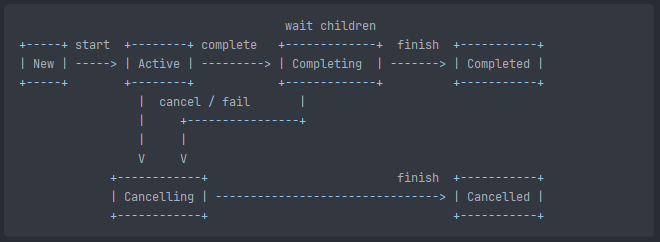

# 8장 잡과 자식 코루틴 기다리기

- `Job` 은 코루틴을 취소하고, 상태를 파악하는 등 다양하게 사용될 수 있다.

### 📌 Job이란 무엇인가?

- Job은 수명을 가지고 있으며 취소가 가능하다. Job은 인테페이스이긴 하지만 구체적인 사용법과 상태를 가지고 있다는 점에서 추상 클래스처럼 다룰 수 있다.
- Job의 수명은 아래와 같은 상태로 나타낸다.



- `Active`
    - 대부분의 코루틴은 Active 상태로 시작되며, 지연 시작되는 코루틴만 `New` 상태에서 시작된다.
    - 잡이 실행되고 코루틴은 Job을 수행한다. Job이 코루틴 빌더에 의해 생성되었을 때 코루틴의 본체가 실행되는 상태이다.
    - 이 상태에서 자식 코루틴을 시작할 수 있다.
- `Completing`, `Completed`
    - 실행이 완료되면 상태는 Completing으로 바뀌고 자식들을 기다린다. 자식들의 실행도 모두 끝났다면 Job은 마지막 상태인 Completed로 바뀐다.
- `Cancelling`
    - 만약 Job이 실행 도중 (Active or Completing 상태) 취소되거나 실패하게 되면 Cancelling 상태로 간다. 여기서 연결을 끊거나 자원을 반납하는 등의 후처리 작업을 할 수 있다.
    - 후처리 작업이 완료되면 Job은 Cancelled 상태가 된다.

```kotlin
suspend fun main() = coroutineScope {
    // 빌더로 생성된 Job은
    val job = Job()
    println(job) // JobImpl{Active}@4f8e5cde
    // 메서드로 완료시킬 때까지 Active 상태이다.
    job.complete()
    println(job) // JobImpl{Completed}@4f8e5cde

    // launch는 기본적으로 Active되어 있다.
    val activeJob = launch {
        delay(1000)
    }
    println(activeJob) // StandaloneCoroutine{Active}@2a098129
    // 여기서 잡이 완료될 때까지 기다린다.
    activeJob.join()
    println(activeJob) // StandaloneCoroutine{Completed}@2a098129

    // launch는 New 상태로 지연 시작한다.
    val lazyJob = launch(start = CoroutineStart.LAZY) {
        delay(1000)
    }
    println(lazyJob) // LazyStandaloneCoroutine{New}@20cb9435
    // Active 상태가 되려면 시작하는 함수를 호출해야한다.
    lazyJob.start()
    println(lazyJob) // LazyStandaloneCoroutine{Active}@20cb9435
    lazyJob.join() // 1초 delay
    println(lazyJob) // LazyStandaloneCoroutine{Completed}@20cb9435
}
```

| 상태                   | isActive | isCompleted | isCancelled |
|----------------------|----------|-------------|-------------|
| New (지연 시작할 때)       | false    | false       | false       |
| Active (시작 상태)       | true     | false       | false       |
| Completing (일시적인 상태) | true     | false       | false       |
| Cancelling (일시적인 상태) | false    | false       | true        |
| Cancelled (최종 상태)    | false    | true        | true        |
| Completed (최종 상태)    | false    | true        | false       |
- 코틀린 코루틴 빌더는 자신만의 Job을 생성한다. 대부분 코루틴 빌더는 Job을 반환하므로 어느 곳에서든 사용이 가능하다.
- Job은 코루틴 Context이므로 `coroutineContext[Job]` 을 사용해 접근 하거나 좀더 편하게 접근할 수 있도록 확장 프로퍼티 `job` 도 사용할 수 있다.

```kotlin
// 확장 프로퍼티
public val CoroutineContext.job: Job get() = get(Job) ?: error("Current context doesn't contain Job in it: $this")

fun main() = runBlocking {
    val deferred = async { 
        delay(1000)
        "Test"
    }
    val job: Job = deferred
    
    print(coroutineContext.job.isActive)
}
```

### 📌 자식들 기다리기

- Job의 첫 번째 중요한 이점은 코루틴이 `완료` 될 때까지 기다리는 데 사용될 수 있다는 점이다. 이를 위해 `join` 메서드를 사용한다

> 💡join: 지정한 job이 Completed나 Cancelled와 같은 마지막 상태에 도달할 때까지 기다리는 중단 함수.

- 또한 Job 인터페이스는 모든 자식을 참조할 수 있는 `children` 프로퍼티도 노출시칸다. 이를 통해 모든 자식이 마지막 상태가 될 때까지 기다리는 데 활용할 수 있다.

```kotlin
fun main() = runBlocking {
    launch {
        delay(1000)
        println("Test1")
    }
    launch {
        delay(2000)
        println("Test2")
    }
//    val children = coroutineContext[Job]?.children
    // 확장 프로퍼티를 사용해서 할 수 있다.
    // 이는 coroutineContext[Job]!! 과 동일하기 때문에 지금 예시는 명시적으로 children이 있지만 없다면 error()를 반환해 주의 해야한다.
    val children = coroutineContext.job.children

    val childrenNum = children.count()
    println("Number of children: $childrenNum")
    children.forEach {
        it.join()
    }
    println("All tests are done.")
}
```

### 📌 Job Factory 함수

- Job은 `Job()` Factory 함수를 사용하면 코루틴 없이도 Job을 만들 수 있다. Factory 함수로 생성한느 점은 어떤 코루틴과도 연관되지 않으며, Context로 사용될 수 있다.
- 흔한 실 수 중 하나는 Job() Factory 함수를 사용해 Job을 생성하고, 다른 코루틴의 부모로 지정한 뒤에 join을 호출하는 것이다. 이렇게 되면 자식 코루틴의 모든 작업이 끝나도 Job이 여전히 Active 상태이기 때문에 프로그램이 종료되지 않는다. (다른 코루틴에 의해 여전에 사용될 수 있기 때문)

```kotlin
suspend fun main() = coroutineScope {
    val job = Job()
    launch(job) {
        delay(1000)
        println("Test 1")
    }
    launch(job) {
        delay(2000)
        println("Test 2")
    }
    job.join()
    println("Will not be printed")
}
```

- 따라서 Job의 모든 자식 코루틴에서 join을 호출하는 것이 일반적인 방법이다.

```kotlin
suspend fun main() = coroutineScope {
    val job = Job()
    launch(job) {
        delay(1000)
        println("Test 1")
    }
    launch(job) {
        delay(2000)
        println("Test 2")
    }
    job.children.forEach {
        it.join()
    }
}
```

- Job()은 얼핏보면 생성자를 호출하는 것이라고 착각할 수 있지만, Job은 인터페이스로써 생성자를 갖지 못한다. 이는 간단한 함수로, 가짜 생성자이다.
- 또한 Factory 함수가 반환하는 실제 타입은 Job이 아니라 하위 인터페이스인 `CompletableJob` 이다.

```kotlin
@Suppress("FunctionName")
public fun Job(parent: Job? = null): CompletableJob = JobImpl(parent)
```

- CompletableJob은 다음 두 가지 메서드를 추가하여 Job 인테페이스 기능성을 확장 했다.
    - `complete()` : Boolean
        - Job을 완료하는 데 사용된다.
        - complete() 메서드를 사용하면 모든 자식 코루틴은 작업이 완료될 때까지 실행된 상태를 유지하지만, complete을 호출한 시점 이후로는 새로운 코루틴이 사작될 수 없다.
        - Job이 완료되면 `true` 그렇지 않은 경우 `false` 가 된다.
    - `completeExceptionally(exception: Throwable)` : Boolean
        - 인자로 받은 예외로 Job을 완료시킨다.
        - 모든 자식 코루틴은 주어진 예외를 래핑한 CancellableException으로 즉시 취소 된다.

```kotlin
fun main() = runBlocking {
    val job = Job()

    launch(job) {
        repeat(5) {
            delay(200)
            println("Rep$it")
        }
    }
    launch {
        delay(500)
        job.complete()
    }
    job.join()
    launch(job) {
        println("Will not be printed")
    }
    println("Done")
}
// Rep0
// Rep1
// Rep2
// Rep3
// Rep4
// Done
```