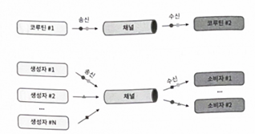
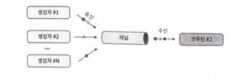

# 16장 채널



- Channel은 두 개의 서로 다른 인터페이스를 구현한 하나의 인터페이스 이다.
    - `SendChannel` 은 원소를 보내거나 채널을 닫는 용도로 사용된다.
    - `ReceiveChannel` 은 원소를 받을 때 사용된다.

```kotlin
public interface Channel<E> : SendChannel<E>, ReceiveChannel<E> { ... }

public interface SendChannel<in E> {
    suspend fun send(element: E)
    fun close(): Boolean
    // ...
}

public interface ReceiveChannel<out E> {
    suspend fun receive(): E
    fun cancel(cause: CancellationException? = null)
    // ...
}
```

- 채널의 진입점을 제한하기 위해 SendChannel이나 ReceiveChannel 중 하나만 노출시키는 것도 가능하다.
- receive는 채널에 원소가 없다면 코루틴은 원소가 들어올 때까지 중단된다.
- send는 채널의 용량이 다 찼을 때 중단된다.

> 💡중단 함수가 아닌 함수로 보내거나 받아야하면 trySend, tryReceive를 사용할 수 있다. 두 연산 모두 연산이 성공여부에 대한 정보를 담고 있는 ChannelResult를 즉시 반환 한다.

- 채널은 송신자, 수신자 수에 제한이 없지만 일반적으로 양쪽 끝에 각각 하나의 코루틴만 있도록 한다.

```kotlin
suspend fun main(): Unit = coroutineScope {
    val channel = Channel<Int>()
    launch { 
        repeat(5) {
            println("Producing next one")
            delay(1000)
            channel.send(it * 2)
        }
        channel.close()
    }
    
    launch {
        // 1
        for (element in channel) {
            println(element)
        }
        // 2
        channel.consumeEach { element ->
            println(element)
        }
    }
}
```

- 위 방식의 문제점은 (특히 예외가 발생시) 채널을 닫는 걸 잊기 쉽다는 것이다. 예외로 인해 코루틴이 원소를 보내는 걸 중단하면, 다른 코루틴은 원소를 영원히 기다려야한다.
- ReceiveChannel을 반환하는 코루틴 빌더인 `produce` 함수를 사용하는 것이 좀 더 편하다.

```kotlin
fun CoroutineScope.produceNumbers(
    max: Int
): ReceiveChannel<Int> = produce { 
    var x = 0
    while (x < 5) send(x++)
}
```

- produce 함수는 빌더로 시작된 코루틴이 어떻게 종료되든 상관없이 채널을 닫는다.

### 📌 채널 타입

- 설정한 용량 크기에 따라 채널은 네 가지로 구분 할 수 있다.

| 채널 타입 | 설명 |
| --- | --- |
| 무제한(Unlimited) | 제한이 없는 용량 버퍼를 가진 Channel.UNLIMITED로 설정된 채널로, send가 중단되지 않는다. |
| 버터(Buffered) | 특정 용량 크기 또는 Channel.BUFFERED(기본: 64개) 로 설정된 채널 |
| 랑데뷰(Rendezvous) | 용량이 0이거나 Channel.RENDEZVOUS 인 채널로, 송신자와 수신자가 만날 때만 원소를 교환한다. |
| 융합(Conflated) | 버퍼 크기가 1인 Channel.CONFLATED를 가진 채널로, 새로운 원소가 이전 원소를 대체한다. |

### 📌 버퍼 오버플로일 때

- 채널을 커스텀화하기 위해 버퍼가 꽉 찼을 때 (onBufferedOverflow 파라미터)의 행동을 정의할 수 있다.
    - `SUSPENDED`(Default) : 버퍼가 가득 찼을 때, send 메서드가 중단된다.
    - `DROP_OLDEST` : 버터가 가득 찼을 때, 가장 오래된 원소가 제거도니다.
    - `DROP_LATEST` : 버터가 가득 찼을 때, 가장 최근의 원소가 제거된다.

```kotlin
suspend fun main(): Unit = coroutineScope {
    val channel = Channel<Int>(
        capacity = 2,
        onBufferOverflow = BufferOverflow.DROP_OLDEST
    )

    launch { 
        repeat(5) {
            channel.send(it * 2)
            delay(100)
            println("Sent")
        }
        channel.close()
    }

    delay(1000)
    for (element in channel) {
        println(element)
        delay(1000)
    }
}
Sent
(0.1초)
Sent
(0.1초)
Sent
(0.1초)
Sent
(0.1초)
Sent
(1 - 4 * 0.1 = 0.6초)
6
(1초)
8
```

### 📌 전달되지 않은 원소 핸들러

- Channel 함수에서 반드시 알아야 할 다른 파라미터는 `onUndeliveredElement` 이다. 원소가 어떠한 이유로 처리되지 않았을 때 호출된다.
- 대부분 채널이 닫히거나 취소되었음을 의미하지만, send, receive, receiveOrNull 또는 hasNext가 에러를 던질 때 발생할 수도 있다.
- 주로 채널에서 보낸 자원을 닫을 때 사용한다.

### 📌 팬아웃 (Fan-out)

- 여러 개의 코루틴이 하나의 채널로부터 원소를 받을 수도 있다. 하지만 원소를 적절하게 처리하려면 반드시 for loop를 사용해야한다. (consumeEach는 여러 개의 코루틴이 사용하기에 안전하지 않다)


```kotlin
@OptIn(ExperimentalCoroutinesApi::class)
fun CoroutineScope.produceNumbers() = produce {
    repeat(10) {
        delay(100)
        send(it)
    }
}

fun CoroutineScope.launchProcessor(
    id: Int,
    channel: ReceiveChannel<Int>
) = launch {
    for (msg in channel) {
        println("#$id received $msg")
    }
}

suspend fun main(): Unit = coroutineScope {
    val channel = produceNumbers()
    repeat(3) { id ->
        delay(10)
        launchProcessor(id, channel)
    }
}
#0 received 0
#1 received 1
#2 received 2
#0 received 3
#1 received 4
#2 received 5
#0 received 6
#1 received 7
#2 received 8
#0 received 9
```

- 원소는 공정하게 배분된다. 채널은 원소를 기다리는 코루틴들을 FIFO 큐로 가지고 있다.

### 📌 팬인 (Fan - in)

- 여러 개의 코루틴이 하나의 채널로 원소를 전송할 수 있다.



```kotlin
suspend fun sendString(
    channel: SendChannel<String>,
    text: String,
    time: Long
) {
    while (true) {
        delay(time)
        channel.send(text)
    }
}

fun main() = runBlocking {
    val channel = Channel<String>()
    launch { sendString(channel, "FOO", 200) }
    launch { sendString(channel, "BAR!", 500) }
    repeat(50) {
        println(channel.receive())
    }
    coroutineContext.cancelChildren()
}
// (200ms)
// FOO
// (200ms)
// FOO
// (200ms)
// BAR!   
// ...
```

- produce 함수를 이용해 여러 개의 채널을 합치는 `fanIn` 함수를 개념적으로 만들어 낼 수 있다.

```kotlin
@OptIn(ExperimentalCoroutinesApi::class)
private fun <T> CoroutineScope.fanIn(
    channels: List<ReceiveChannel<T>>
) = produce {
    for (channel in channels) {
        launch {
            for (element in channel) {
                send(element)
            }
        }
    }
}           
```

### 📌 파이프라인

- 한 채널로부터 받은 원소를 다른 채널로 전송하는 경우가 있는데, 이를 파이프라인이라고 한다.

```kotlin
fun CoroutineScope.numbers(): ReceiveChannel<Int> =
    produce {
        repeat(3) { num ->
            send(num + 1)
        }
    }

fun CoroutineScope.square(numbers: ReceiveChannel<Int>) =
    produce {
        for (num in numbers) {
            send(num * num)
        }
    }

suspend fun main() = coroutineScope { 
    val numbers = numbers()
    val squared = square(numbers)
    for (result in squared) {
        println(result)
    }
}
// 1
// 4
// 9
```

### 📌 통신의 기본 형태로서의 채널

- 채널은 서로 다른 코루틴이 동시에 통신할 때 유용하다. 충돌이 발생하지 않으며(공유 상태로 인한 문제가 일어나지 않는다), 공정함을 보장한다.

```kotlin
suspend fun CoroutineScope.sendOrders(
    orders: ReceiveChannel<Order>,
    baristaName: String
): ReceiveChannel<CoffeeResult> = produce {
    for (order in orders) {
        val coffee = prepareCoffee(order.tpye)
        send(
            CoffeeResult(
                coffee = coffee,
                customer = order.customer,
                baristaName = baristaName
            )
        )
    }
}

// fanIn 함수를 사용해 생성한 결과를 하나로 합칠 수 있다.
val coffeeResults = fanIn(
    serveOrders(ordersChannel, "first"),
    serveOrders(ordersChannel, "second"),
    serveOrders(ordersChannel, "third"),
)
```