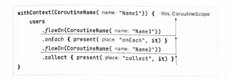

# 22장 플로우 생명주기 함수

### 📌 onEach

- 플로우의 값을 하나씩 받기 위해 onEach 함수를 사용한다.

```kotlin
suspend fun main() {
    flowOf(1, 2, 3, 4)
        .onEach { print(it) }
        .collect() // 1234
}
```

- onEach 람다식은 중단 함수이며, 원소는 순서대로 처리된다.

```kotlin
public fun <T> Flow<T>.onEach(action: suspend (T) -> Unit): Flow<T> = transform { value ->
    action(value)
    return@transform emit(value)
}

suspend fun main() {
    flowOf(1, 2, 3, 4)
        .onEach { delay(1000) }
        .collect { println(it) } // 1234
}
// (1초후)
// 1
// (1초후)
// 2
// (1초후)
// 3
// (1초후)
// 4

```

### 📌 onStart

- onStart 함수는 최종 연산이 호출될 때와 같이 플로우가 시작되는 경우에 호출되는 리스너를 설정한다.
- onStart는 첫 번째 원소가 생성되는 걸 기다렸다 호출되는 게 아니라는 것이 중요하다. 첫 번째 원소를 요청했을 때 호출되는 함수다

```kotlin
suspend fun main() {
    flowOf(1, 2)
        .onEach { delay(1000) }
        .onStart { println("Before") }
        .collect { println(it) }
}
// Before
// (1초후)
// 1
// (1초후)
// 2

// onStart에서도 원소를 내보낼 수 있다.
onEach { emit(0) }
// 0
// (1초후)
// 1
// ...
```

### 📌 onCompletion

- 플로우를 완료할 수 있는 여러 가지 방법이 있다. 잡히지 않은 예외가 발생했거나 코루틴이 취소되었을 때, 플로우 빌더가 끝났을 때이다.

```kotlin
suspend fun main() {
    flowOf(1, 2)
        .onEach { delay(1000) }
        .onCompletion { println("Completed") }
        .collect { println(it) }
}
```

- 안드로이드에서는 (네트워크 응답을 기다릴때) onStart, 가리기 위해서 onCompletion을 사용한다.

### 📌 onEmpty

- 플로우는 예기치 않은 이벤트가 발생하면 값을 내보내기 전에 완료될 수 있다. onEmpty 함수는 원소를 내보내기 전에 플로우가 완료되면 실행된다.

```kotlin
suspend fun main() = coroutineScope {
    flow<List<Int>> { delay(1000) }
        .onEmpty { emit(emptyList()) }
        .collect { println(it) }
}
// (1초후)
// []
```

### 📌 catch

- 플로우에서도 예외가 발생할 수 있다. 이러한 예외는 아래로 흐르면서 처리하는 단계를 하나씩 닫는다. 하지만 예외를 catch 메서드를 통해 잡고 관리할 수 있다.

```kotlin
class MyError: Throwable("My error")

val flow = flow {
    emit(1)
    emit(2)
    throw MyError()
}

suspend fun main(): Unit {
    flow.onEach { println("Got $it") }
        .catch { println("Caught $it") }
        .collect { println("Collected $it")}
}
// Got 1
// Collected 1
// Got 2
// Collected 2
// Caught chapter19.MyError: My error
```

- catch 함수의 윗부분에서 던진 예외에만 반응한다. (예외는 아래로 흐를 때 잡는다고 생각)

> 💡오직 onCompletion 핸들러만 예외가 발생했을 때 호출된다.

### 📌 잡히지 않는 예외

- 플로우에서 잡히지 않는 예외는 즉시 취소하며, collect는 예외를 다시 던진다. 플로우 바깥에서 전통적인 try-catch 블록을 사용해서 예외를 잡을 수도 있다.

```kotlin
val flow = flow {
    emit("Message")
    throw MyError()
}

suspend fun main(): Unit {
    try {
        flow.collect { println("Collected $it") }
    } catch (e: MyError) {
        println("Caught!")
    }
}
// Collected Message
// Caught!
```

- 앞서 catch를 사용하는 건 최종 연산에 발생한 예외를 처리할때는 도움이 전혀되지 않는다. 따라서 collect의 연산을 onEach에 옮기고 catch 이전에 두는 방법을 많이 사용한다.

```kotlin
val flow = flow {
    emit("Message1")
    emit("Message2")
}

suspend fun main(): Unit {
    flow.onStart { println("Before") }
        .onEach { throw MyError() }
        .catch { println("Caught $it") }
        .collect()
}
// Before
// Caught chapter19.MyError: My error
```

### 📌 flowOn

- (onEach, onStart, onCompletion 과 같은) 플로우 연산과 (flow, channelFlow와 같은) 플로우 빌더의 인자로 사용되는 람다식은 모두 `중단 함수` 이다.
- 중단 함수는 컨텍스트가 필요하며 부모와 관계를 유지한다. 플로우의 함수들은 collect가 호출되는 곳의 컨텍스트를 얻어온다.

```kotlin
fun usersFlow(): Flow<String> = flow {
    repeat(2) {
        val ctx = currentCoroutineContext()
        val name = ctx[CoroutineName]?.name
        emit("User$it in $name")
    }
}

suspend fun main(): Unit {
    val users = usersFlow()
    withContext(CoroutineName("Name1")) {
        users.collect { println(it) }
    }
    withContext(CoroutineName("Name2")) {
        users.collect { println(it) }
    }
}
// User0 in Name1
// User1 in Name1
// User0 in Name2
// User1 in Name2
```

- 위 코드는 최종 연산을 호출하면 상위에 있는 모든 원소를 요청하면서 코루틴 컨텍스트를 전달한다. 하지만 `flowOn` 함수로 컨텍스트를 변경할 수도 있다.

```kotlin
suspend fun present(place: String, message: String) {
    val ctx = coroutineContext
    val name = ctx[CoroutineName]?.name
    println("[$name] $message on $place")
}

fun messagesFlow(): Flow<String> = flow {
    present("flow builder", "Message")
    emit("Message")
}

suspend fun main(): Unit {
    val users = messagesFlow()
    withContext(CoroutineName("Name1")) {
        users
            .flowOn(CoroutineName("Name3"))
            .onEach { present("onEach", it) }
            .flowOn(CoroutineName("Name2"))
            .collect { present("collect", it) }
    }
}
// [Name3] Message on flow builder
// [Name2] Message on onEach
// [Name1] Message on collect
```

- flowOn은 플로우에서 윗부분에 있는 함수에서만 작동하는 걸 알아야한다.



### 📌 launchIn

- collect는 플로우가 완료될 때까지 코루틴을 중단하는 중단 연산이다.
- launch 빌더로 collect를 래핑하면 플로우를 다른 코루틴에서 처리할 수 있다.
- 플로우의 확장 함수인 `launchIn` 을 사용하면 유일한 인자로 스코프를 받아 collect를 새로운 코루틴에서 시작할 수 있다.

```kotlin
suspend fun main(): Unit = coroutineScope {
    flowOf("User1", "User2")
        .onStart { println("Users:") }
        .onEach { println(it) }
        .launchIn(this)
}
// Users:
// User1
// User2
```

- 별도의 코루틴에서 플로우를 시작하기 위해 launchIn 을 주로 사용한다.