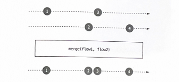
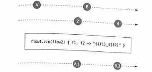
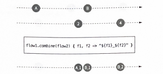
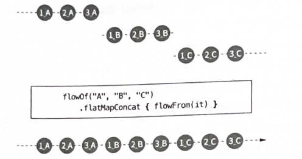
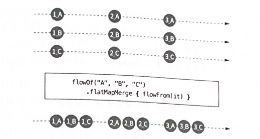
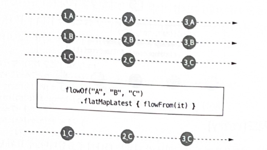

# 23장 플로우 처리

### 📌 map, filter, take, drop

- map은 각 원소를 변환 함수에 따라 변환하는 기능을 담당한다.

```kotlin
suspend fun main() {
    flowOf(1, 2, 3)
        .map { it * it }
        .collect { println(it) }
}
// 1
// 4
// 9
```

- filter 는 주어진 조건에 맞는 값들로만 가진 flow를 반환한다.

```kotlin
suspend fun main() {
    (1..10).asFlow()
        .filter { it <= 5 } // 1, 2, 3, 4, 5
        .filter { isEven(it) } // 2, 4
        .collect { println(it) }
}

fun isEven(num: Int): Boolean = num % 2 == 0
```

- take와 drop은 특정 수의 원소만 통과, 무시하기위해 사용한다.

```kotlin
suspend fun main() {
    ('A'..'Z').asFlow()
        .take(5)
        .collect { print(it) }
}
// ABCDE
```

### 📌 merge, zip, combine

- 두 개의 플로우를 하나의 플로우로 합치는 것에 대해 함수들을 보자. 가장 간단한 방법은 두 개 의 플로우에서 생성된 원소들을 하나로 합치는 것이다.
- 최상위 레벨 함수 `merge`를 사용하면 이런 과정을 수행할 수 있다.

```kotlin
suspend fun main() {
    val ints = flowOf(1, 2, 3)
    val doubles = flowOf(0.1, 0.2, 0.3)

    val together = merge(ints, doubles)
    print(together.toList())
}
// [1, 2, 0.1, 0.2, 0.3, 3]
// [1, 0.1, 2, 3, 0.2, 0.3]
// 또는 다른 조합 가능한 것중 하나
```



- 예시와 같이 `merge`의 특징은 한 플로우의 원소가 다른 플로우를 기다리지 않는 것이 중요하다.
- 다음 예제에서 첫 번째 플로우의 원소 생성이 지연된다고 해서 두 번째 플로우의 원소 생성이 중단되지 않는다.

```kotlin
suspend fun main() {
    val ints = flowOf(1, 2, 3)
        .onEach { delay(1000) }
    val doubles = flowOf(0.1, 0.2, 0.3)

    val together = merge(ints, doubles)
    together.collect {
        println(it)
    }
}
// 0.1
// 0.2
// 0.3
// (1초후)
// 1
// (1초후)
// 2
// (1초후)
// 3
```

- 여러 개의 이벤트들을 똑같은 방법으로 처리할 때 merge를 사용한다.

---

- 다음 함수는 두 플로우로부터 쌍을 만드는 `zip` 이다.
- 원소가 쌍을 이루는 방법을 정하는 함수도 필요하다. 각 원소는 한 쌍의 일부가 되므로 쌍이 될 원소를 기다려야 한다. 쌍을 이루지 못하고 남은 원소는 유실되므로 한 플로우에서 zipping이 완료되면 생성되는 플로우 또한 완료된다.

```kotlin
suspend fun main() {
    val flow1 = flowOf("A", "B", "C")
        .onEach { delay(400) }

    val flow2 = flowOf(1, 2, 3, 4)
        .onEach { delay(1000) }

    flow1.zip(flow2) { f1, f2 ->
        "${f1}_${f2}"
    }.collect {
        println(it)
    }
}
// (1초후)
// A_1
// (1초후)
// B_2
// (1초후)
// C_3
```



---

- 두 개의 플로우를 합칠 때 사용되는 중요한 함수 중 마지막은 `combine` 이다.
- zip 처럼 원소들로 쌍을 형성하기 때문에 첫 번째 쌍을 만들기 위해 느린 플로우를 기다려야 한다.
- combine을 사용하면 모든 새로운 원소가 전입자를 대체하게 된다.



```kotlin
suspend fun main() {
    val flow1 = flowOf("A", "B", "C")
        .onEach { delay(400) }

    val flow2 = flowOf(1, 2, 3, 4)
        .onEach { delay(1000) }

    flow1.zip(flow2) { f1, f2 ->
        "${f1}_${f2}"
    }.collect {
        println(it)
    }
}
// (1초후)
// B_1
// (0.2초후)
// C_1
// (0.8초후)
// C_2
// (1초후)
// C_3
// (1초후)
// C_4
```

### 📌 flow와 scan

- fold는 (초기 값부터 시작하여) 주어진 원소 각각에 대해 두 개의 값을 하나로 합치는 연산을 적용하여 컬렉션의 모든 값을 하나로 합친다.
- fold는 `최종 연산`으로, 플루우에서도 사용할 수 있으며 플로우가 완료될 때까지 중단된다.

```kotlin
suspend fun main() {
    val list = flowOf(1, 2, 3, 4)
        .onEach { delay(1000) }
    val res = list.fold(0) { accumulator, value -> accumulator + value  }
    println(res)
}
// (4초후)
// 10
```

- fold 대신 scan을 사용할 수도 있다. scan은 누적되는 과정의 모든 값을 생성하는 `중간 연산`이다.
- scan은 이전 단계에서 값을 받은 즉시 새로운 값을 만들기 때문에 flow에서 유용하게 사용된다.

```kotlin
suspend fun main() {
    flowOf(1, 2, 3, 4)
        .onEach { delay(1000) }
        .scan(0) { acc, v -> acc + v }
        .collect { println(it) }
}
// 0
// (1초후)
// 1
// (1초후)
// 3
// (1초후)
// 6
// (1초후)
// 10
```

### 📌 flatMapConcat, Merge, Lastest

- flatMap은 맵과 비슷하지만 변환 함수가 평탄화된 컬렉션을 반환해야 한다는 점이다.
- `flatMapConcat` 함수는 생성된 플로우를 하나씩 처리한다. 그래서 두 번째 플로우는 첫 번째 플로우가 완료되었을 때 사용할 수 있다.

> 💡flatMapConcat은 동기적으로 실행된다고 보면 될것같다.

```kotlin
fun otherFlow(str: String) = flowOf(1, 2, 3)
    .onEach { delay(1000) }
    .map { "${it}_${str}" }

@OptIn(ExperimentalCoroutinesApi::class)
suspend fun main() {
    flowOf("A", "B", "C")
        .flatMapConcat { otherFlow(it) }
        .collect { println(it) }
}
// 1_A
// (1초후)
// 2_A
// (1초후)
// 3_A
// (1초후)
// 1_B
// (1초후)
// 2_B
// (1초후)
// 3_B
// (1초후)
// 1_C
// (1초후)
// 2_C
// (1초후)
// 3_C
```



- 두 번째 함수인 flatMapMerge는 만들어진 플로우를 동시에 처리한다.

```kotlin
@OptIn(ExperimentalCoroutinesApi::class)
suspend fun main() {
    flowOf("A", "B", "C")
        .flatMapMerge { otherFlow(it) }
        .collect { println(it) }
}
// (1초후)
// 1_A
// 1_C
// 1_B
// (1초후)
// 2_C
// 2_B
// 2_A
// (1초후)
// 3_B
// 3_A
// 3_C
```



- flatMapMerge는 concurrency 인자를 사용해 동시에 처리할 수 있는 플로우의 수를 설정할 수 있다.
- 인자의 기본값은 `16` 이지만 JVM에서 `DEFAULT_CONCURRENCY_PROPERTY_NAME` 프로퍼티를 사용해 변경 가능하다.
- 여러 개의 원소를 가진 플로우에서 flatMapMerge를 사용하면 기본값으로 제한되어 있어 동시에 16개만 처리 가능하다는 걸 유념해야한다.

---

- flatMapLatest는 새로운 플로우가 나타나면 이전에 처리하던 플로우를 잊어버린다.

```kotlin
@OptIn(ExperimentalCoroutinesApi::class)
suspend fun main() {
    flowOf("A", "B", "C")
        .flatMapLatest { otherFlow(it) }
        .collect { println(it) }
}
// (1초후)
// 1_C
// (1초후)
// 2_C
// (1초후)
// 3_C
```



### 📌 retry

- 예외는 플로우를 따라 흐르면서 각 단계를 하나씩 종료한다. 종료된 단계는 비활성화되기 때문에, 예외가 발생한 뒤 메시지를 보내는 건 불가능하지만, 각 단계가 이전 단계에 대한 참조를 가지고 있으며, 플로우를 다시 시작하기 위해 참조를 사용할 수 있다.
- 이 원리로 코틀린은 `retry`와 `retryWhen` 함수를 제공한다.

```kotlin
public fun <T> Flow<T>.retryWhen(predicate: suspend FlowCollector<T>.(cause: Throwable, attempt: Long) -> Boolean): Flow<T> =
    flow {
        var attempt = 0L
        var shallRetry: Boolean
        do {
            shallRetry = false
            val cause = catchImpl(this)
            if (cause != null) {
                if (predicate(cause, attempt)) {
                    shallRetry = true
                    attempt++
                } else {
                    throw cause
                }
            }
        } while (shallRetry)
    }
```

### 📌 중복 제거 함수

- distinctUntilChanged 함수는 반복되는 원소가 동일하다고 판단되면 제거한다. 이 함수는 `바로 이전의 원소` 와 동일한 원소만 제거한다.

```kotlin
suspend fun main() {
    flowOf(1, 2, 2, 3, 3, 1, 1, 3)
        .distinctUntilChanged()
        .collect { print(it) }
}
```

- 이 함수의 변형된 형태인 `distinctUntilChangedBy` 함수도 있다. 해당 함수는 두 원소가 동일한지 판단하기 위해 비교할 키 선택자를 인자로 받는다.

```kotlin
suspend fun main() {
    val users = flowOf(
        User(1, "Alex"),
        User(1, "Bob"),
        User(2, "Bob"),
        User(2, "Celine"),
    )

    println(users.distinctUntilChangedBy { it.id }.toList())
}
// [[1] Alex, [2] Bob]
```

### 📌 최종 연산

- 이전까지 collect를 사용했지만, reduce, first, count 등 최종 연산을 해주는 메서드들이 있다. 플로우에서 제공하지 않는 것을 직접 구현한다면 사용할 수 있다.

```kotlin
suspend fun Flow<Int>.sum(): Int {
    var sum = 0
    collect { value ->
        sum += value
    }
    return sum
}
```